# Introduction of SQL
#### SQL (Structure Query Language) is a Standard Programming Language used to communicate and manage database. It is mainly used for storing, retrieving, updating and deleting data in relational database.
#### Management system (RDBMS) Such as MySQL, PostgresSQL, Oracle and SQL
For Example :- When you order something from amazon, all your order details ( Product, Price, Address, Delivery, Status) are stored in a database
SQL helps Amazon insert, find, update or delete that order information
# Why Learning SQl is necessary?
#### Learning SQL is necessary because it helps you quickly access, manage, and analyze data, saves time, works with almost all databases, and is a highly in-demand skill for many careers.
# Why SQL Server is used?
#### SQL Server is used to store, manage, and retrieve data efficiently for applications, websites, and businesses.

#### In short, it’s used for:

1. Data storage – Keeps large amounts of information safe in a structured way.


2. Data management – Lets you insert, update, delete, and organize data easily.


3. Data analysis – Runs queries to extract insights and generate reports.


4. Security – Protects data with permissions, encryption, and authentication.


5. Integration – Works with many apps, programming languages, and BI tools.


It’s popular because it’s reliable, secure, and scalable, making it suitable for small apps to large enterprise systems.
# Key Points about SQL
1. Full form – Structured Query Language.


2. Purpose – Used to store, manage, and retrieve data from relational databases.


3. Works with – MySQL, SQL Server, Oracle, PostgresSQL, and more.


4. Main operations – CRUD: Create, Read, Update, Delete.


5. Types of commands – DDL (structure), DML (data), DCL (control), TCL (transactions).


6. Portable skill – Same basic syntax works across many database systems.


7. Essential for – Developers, data analysts, testers, and business intelligence roles.

# Advantages of SQL:
- Simple, English-like syntax.
- Quickly retrieves and processes large amounts of data.
- Works with different database systems and platforms.
- Follows ANSI/ISO standards.
- Can handle complex data operations and joins.
- Supports user permissions and data protection.
- Works with many programming languages and tools.
- Suitable for both small and enterprise-level databases.
# Installation of SQL Server

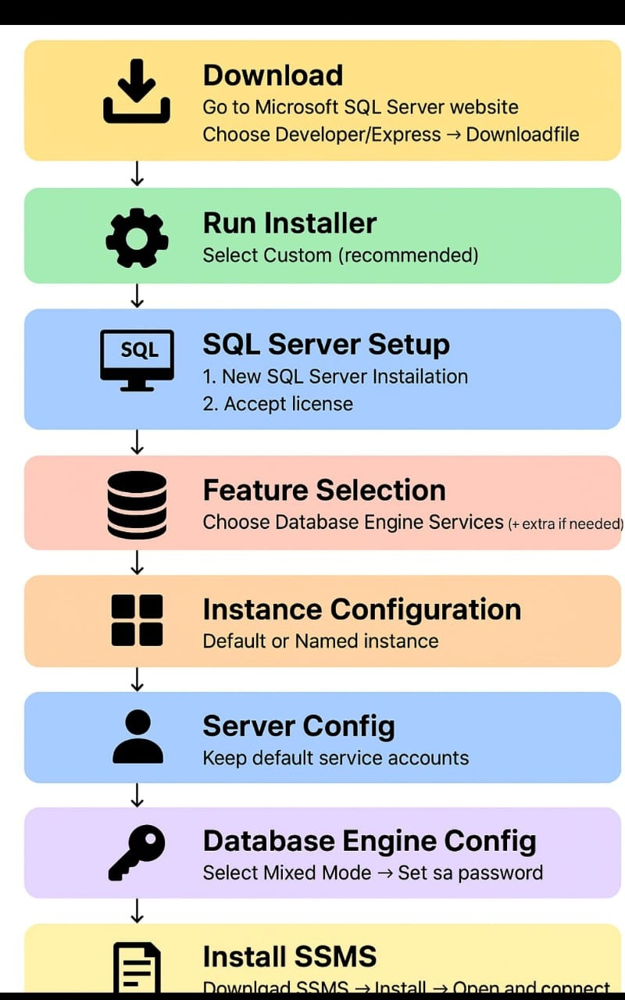

# Database Language
#### Database language are specialized language used to interact with a database. They allow users to perform different task such as defining, controlling and manipulating the data.

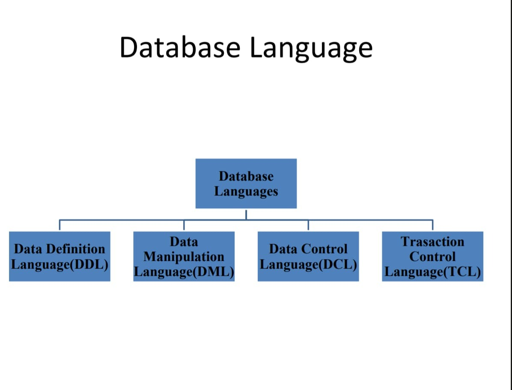

# Data Definition Language(DDL)
- DDL stands for the Data Definition Language. It is used to define database structure or pattern.
- It is used to create schema, tables, indexes, constraints etc. int the database.
- Using the DDL statement, you are create the skeleton of the database.
- Data definition language is used to store the information of metadata like the number of tables and schemas, their names, indexes, columns in each table, constraints etc.

# Data Manipulation Language (DML)
- DML stands for Data Manipulation Language. It is used for accessing and manipulating data in a database. It handles user requests.

# Data Control Language (DCL)
- DCL stands for Data Control Language. It is used to retrieve the stored or saved data.
- The DCL execution is transactional. It is also has rollback parameters.

# Transaction Control Language (TCL)
- TCL is used to run the change made by the DML Statement. TCL can be grouped into a logical transaction.


# ALTER COMMAND
#### The ALTER command is crucial for evolving database schemas as requirements change,allowing for flexibility without needing to recreate entire tables.
#### Alter command is used for alternating the data in many forms like :-
1)Add a Column

         Syntax :- ALTER TABLE table_name
         ADD column_name datatype;

2) Rename existing column :-
   By using Rename Command we can change the name of the column that is already existing

         Syntax :- ALTER TABLE table_name
       RENAME TO new_table_name;

3) DROP a column using Alter :-
   By using DROP Command we can delete existing Column in a table

    <pre>Syntax :- ALTER TABLE Table-name
   DROP COLUMN column_name</pre>

4) modify
   we can change an existing Column size and data type
<pre>Syntax :- ALTER TABLE table name
   ALTER COLUMN column_name new_datatype;</pre>

# DELETE COMMAND
This command is used to erase some or all the previous table record. If we don't Specify the where condition than all the row would be deleted

     Syntax :- DELETE FROM table_name;

# UPDATE
This UPDATE statement is used to modify the existing records in a table.

    Syntax :- UPDATE table_name;

# Constraints
#### In SQL, constraints are rules applied to table columns to maintain data integrity, ensuring the data remains valid, accurate, and consistent.

Here are the main types of constraints:

- NOT NULL - Ensures a column cannot store NULL Values.
  <pre>Example :- name VARCHAR(50) NOT NULL</pre>
- UNIQUE - Ensure all values in a column are unique.
  <pre>Example :- email VARCHAR(100) UNIQUE</pre>
- PRIMARY KEY - Uniquely identifies each row in a table combine NOT NULL and UNIQUE.
  <pre>Example :- PRIMARY KEY (id)</pre>
- FOREIGN KEY - Ensure a value in one table matches a value in another table's primary key.
    <pre>Example :- FOREIGN KEY(dept_id) REFERENCES department(id)</pre>

# SQL SELECT Query
SQL Select is used to retrieve data from one or more tables, either all records or specific result based on conditions. It returns the output in a tabular format of rows and columns.
- Extracts data from tables.
- Targets specific or all columns(*).
- Supports filtering, sorting, grouping and joins.
- Results are stored in a result set.

<pre>Syntax :- SELECT Column1, Column2... From table_name;</pre>
# Parameters
- column1, column2: The columns you wants to retrieve.
- table_name: The name of the table you're querying.


### The SQL SELECT DISTINCT Statement
The SELECT DISTINCT statement is used to return only distinct (different) values.

Example:

Select all the different countries from the "Customers" table:

    SELECT DISTINCT Country FROM Customers;

SELECT Example Without DISTINCT:

If you omit the DISTINCT keyword, the SQL statement returns the "Country" value from all the records of the "Customers" table:

Example:

    SELECT Country FROM Customers;


# Example of SELECT Statement
Let us start by creating a sample table that we will use for our examples. We will also insert some sample data to make the demonstration more practical.

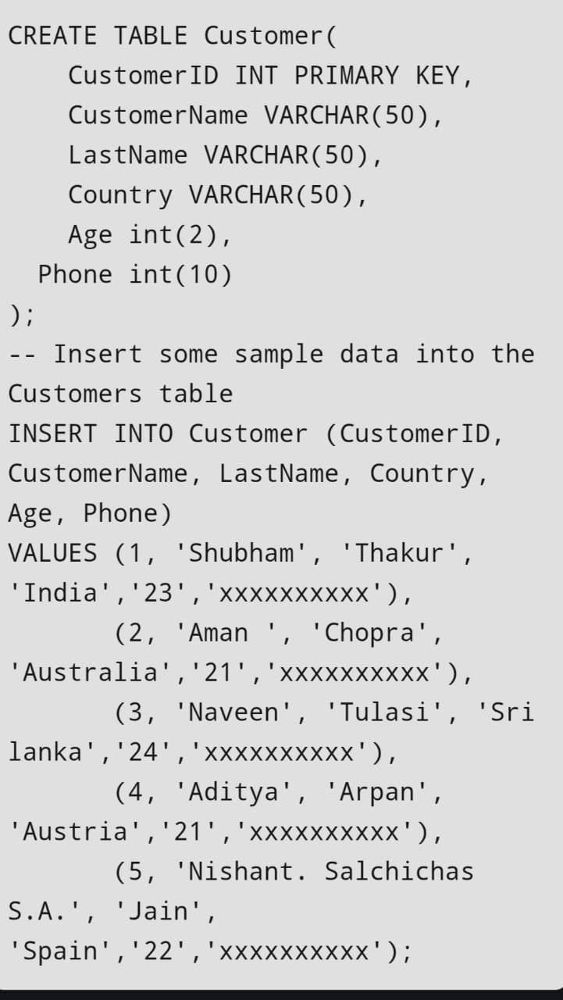

# Output

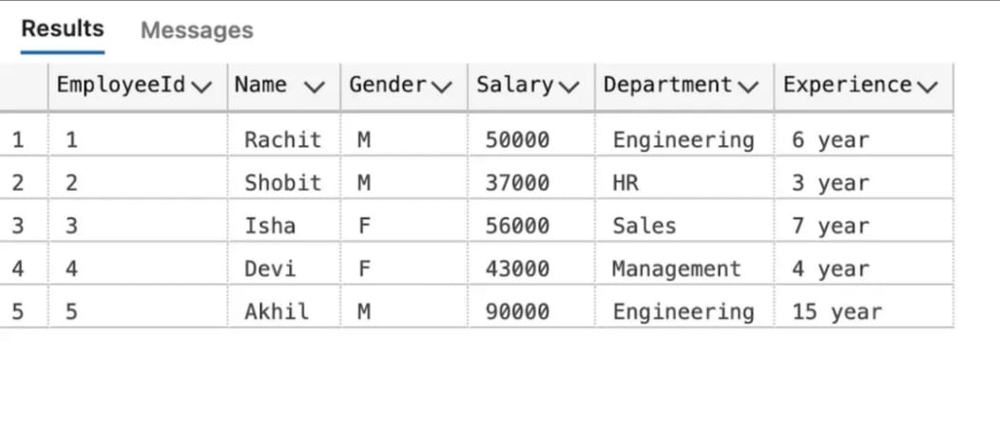

# Example 1: Select Specific Columns
In this example, We will demonstrate how to retrieve specific columns from the customer table. Here we will fetch only customerName and LastName for each record.
# Query:
<pre>SELECT CustomerName, LastName FROM Customer;</pre>
# Output

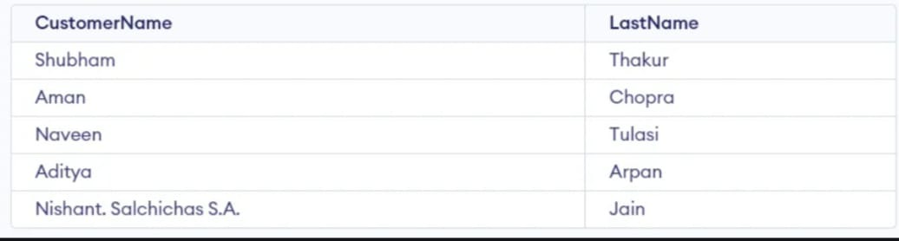

# Example 2: Select All Columns
In this example, we will fetch all the fields from the table Customer.
# Query
<pre>SELECT * FROM Customer;</pre>
# Output


# Example 3: SELECT Statement with WHERE Clause
Suppose we want to see table values with Specific conditions then WHERE Clause is used with select statement. In this example, filter customers who are 21 years old.
# Query:
<pre>SELECT CustomerName
FROM Customer
Where Age = '21';</pre>
# Output
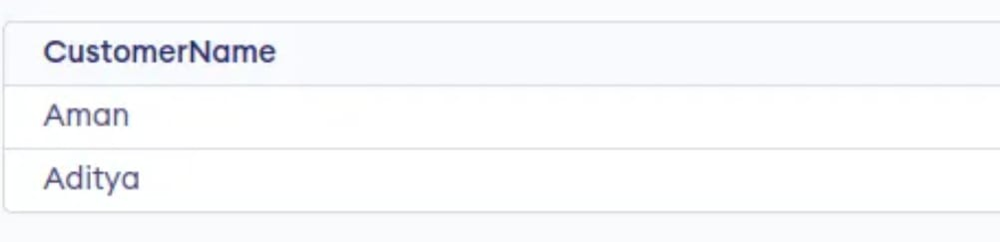


# Example 4: SELECT with GROUP BY Clause
In this example, we will use SELECT statement with GROUP BY Clause to group rows and perform aggregation. Here,count order per customer.
# Query:
<pre>SELECT Customer_id, COUNT(*) AS
Count(items)
FROM orders
GROUP BY customer_id;</pre>
# Output
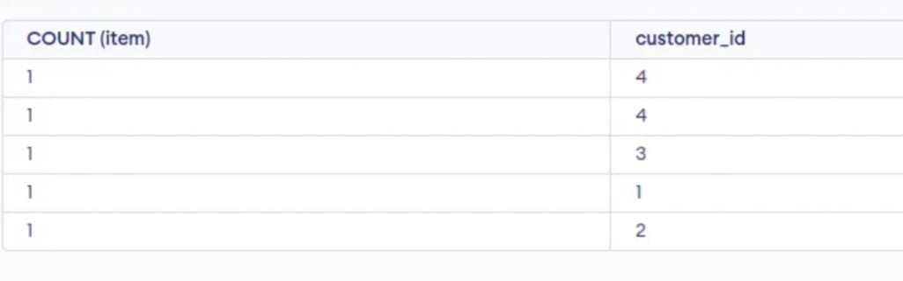

# Example 5: SELECT Statement with HAVING Clause
use HAVING to filter result after grouping consider the following database for fetching departments with total salary above 50,000 Use WHERE for row-level filtering, HAVING for group-level filtering.
# Query:
<pre>SELECT Department, sum(Salary) as salary
FROM employee
GROUP BY department
HAVING SUM(Salary) >=50000;</pre>
# Output:

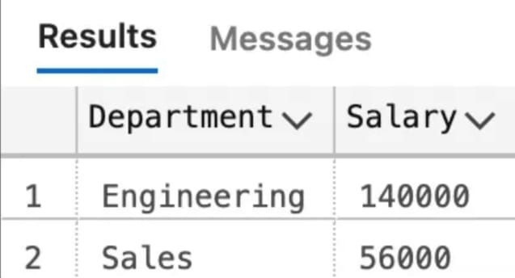


# Example 6: SELECT Statement with order clause in SQL
In this example, we will use SELECT Statement with ORDER BY clause. Here, Sort result by Age in descending order.
# Query
SELECT * FROM Customer ORDER BY Age DESC;
# Output


# Sql Operators :

### SQL AND Operator:
The AND operator allows you to filter data based on multiple conditions, all of which must be true for the record to be included in the result set.

Syntax:

The syntax to use the AND operator in SQL is:

    SELECT * FROM table_name WHERE condition1 AND condition2 AND ...conditionN;
Here,

table_name: name of the table
condition1,2,..N: first condition, second condition, and so on.

### SQL OR Operator
The OR Operator in SQL displays the records where any one condition is true, i.e. either condition1 or condition2 is True.

Syntax:

The syntax to use the OR operator in SQL is:

    SELECT * FROM table_name WHERE condition1 OR condition2 OR... conditionN;

table_name: name of the table
condition1,2,..N: first condition, second condition, and so on

#### Examples :

Let's look at some examples of AND and OR operators in SQL and understand their working.

Now, we consider a table database to demonstrate AND & OR operators with multiple cases.

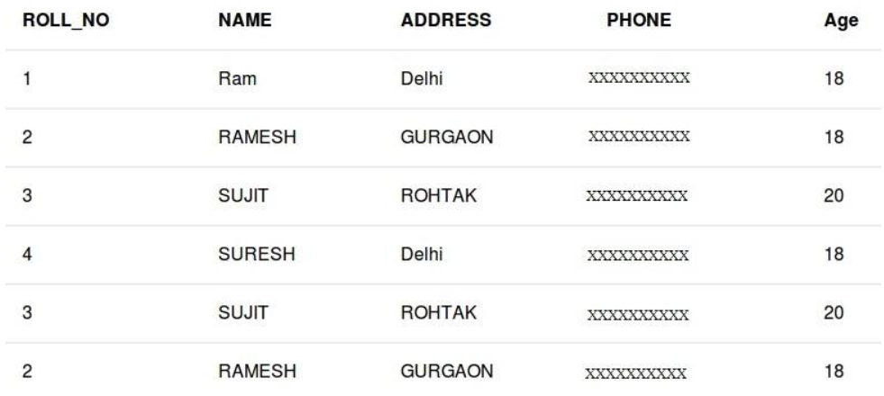

##### Example 1: SQL AND Operator
If suppose we want to fetch all the records from the Student table where Age is 18 and ADDRESS is Delhi.

Query:

    SELECT * FROM Student
    WHERE Age = 18 AND ADDRESS = 'Delhi';

Output:

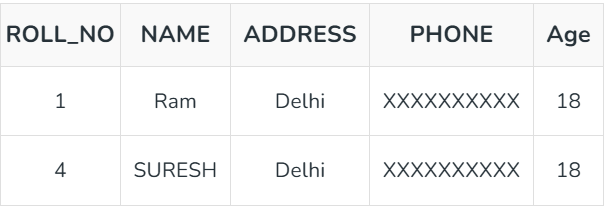

#### Example 2: SQL OR Operator
To fetch all the records from the Student table where NAME is Ram or NAME is SUJIT.

Query:

    SELECT * FROM Student
    WHERE NAME = 'Ram' OR NAME = 'SUJIT';
Output:

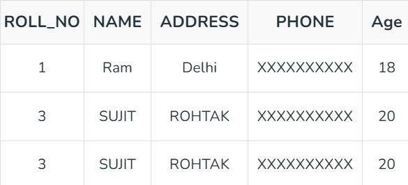


### Logical operators :

The AND operator returns TRUE only if all the conditions it connects are met. It's used to narrow down results by ensuring that records satisfy multiple criteria simultaneously.

Syntax:


    SELECT column1, column2, ...
    FROM table_name
    WHERE condition1 AND condition2 AND condition3 ...;

Example: To find all employees in the 'Sales' department who have more than five years of service :


    SELECT *
    FROM employees
    WHERE department = 'Sales' AND years_of_service > 5;

#### OR Operator
The OR operator returns TRUE if at least one of the conditions it connects is met. It broadens the result set by including records that satisfy any of the specified conditions.

Syntax:


    SELECT column1, column2, ...
    FROM table_name
    WHERE condition1 OR condition2 OR condition3 ...;
Example: To retrieve all products that are either in the 'Electronics' category or have more than 100 in stock :


    SELECT *
    FROM products
    WHERE category = 'Electronics' OR stock_quantity > 100;

#### NOT Operator
The NOT operator reverses the result of a single condition. It returns TRUE if the condition is FALSE, and vice versa. It is used to exclude records that meet a specific criterion.

Syntax:


    SELECT column1, column2, ...
    FROM table_name
    WHERE NOT condition;
Example: To find all students who have not yet graduated :


    SELECT *
    FROM students
    WHERE NOT is_graduated;
    Other Important Logical Operators

IN: This operator allows you to specify a list of values to match. It is a more concise way to write multiple OR conditions.

Example: To select employees from either 'Allahabad' or 'Patna' :


    SELECT *
    FROM employee
    WHERE emp_city IN ('Allahabad', 'Patna');
LIKE: Used for pattern matching in string data. It works with wildcard characters: % (represents zero or more characters) and _ (represents a single character).

Example: To find employees whose first name starts with 'J' :


    SELECT *
    FROM employees
    WHERE first_name LIKE 'J%';
ANY and ALL: These operators are used with subqueries and comparison operators. ANY returns TRUE if the condition is true for any of the values in the range. ALL returns TRUE only if the condition is true for all values in the range.

Order of Precedence
When a query contains multiple logical operators, SQL evaluates them in a specific order :
1. NOT
2. AND
3. OR

### IN Operator
The IN Operator in SQL is used to specify multiple values/sub-queries in the WHERE clause. It provides an easy way to handle multiple OR conditions.

We only pass a single condition in the WHERE clause, however there might be situations where we need to select data based on multiple conditions. For such cases, the IN operator is used.

Note: If any of the conditions are passed using the IN operator, they will be considered true
Syntax:

The Syntax of the IN operator is as follows:

    SELECT column_name FROM table_name
    
    WHERE condition IN (condition_value1, condition_value2 .....);

### Not Operator :

The SQL NOT operator is used to reverse the boolean result of a condition in SQL. It helps in retrieving records that do not match a specific condition. It is mostly used to specify what should not be included in the results table.

Syntax:

    SELECT column1, colomn2, …
    FROM table_name WHERE NOT condition; 

### NOT EQUAL Operator in SQL
NOT EQUAL Operator in SQL is used to compare two values and return if they are not equal. This operator returns boolean values. If given expressions are equal, the operator returns false otherwise true. If any one expression is NULL, it will return NULL.

It performs type conversion when expressions are of different data types, for example, 5!= "Five".

We use the NOT EQUAL operator to display our table without some exceptional values. For example, Let's, consider a table 'Students'. For this table, we have, "id", "name", and "marks" as its columns. Now we want to display all those rows that have marks not equal to "100". In this kind of situation, the NOT EQUAL operator can be used.

    Note: <> and != perform the same operation i.e. check inequality. The only difference between <> and != is that <> follows
    the ISO standard but != does not. So it is recommended to use <> for NOT EQUAL Operator.
Syntax:

The SQL NOT EQUAL Operator syntax is:

    SELECT * FROM table_name
    WHERE column_name != value;

## IS NULL Operator :
The IS NULL operator is used to check if a column contains a NULL value. If a column value is NULL, the operator returns TRUE; otherwise, it returns FALSE. It's commonly used in WHERE clauses to filter rows that contain NULL values in specific columns.

Syntax:

SQL IS NULL syntax is:

    SELECT * FROM table_name
    WHERE column_name IS NULL;


###  UNION operator:
The SQL UNION operator combines the results of two or more SELECT statements into one result set. By default, UNION removes duplicate rows, ensuring that the result set contains only distinct records.

There are some rules for using the SQL UNION operator.

Rules for SQL UNION

- Each table used within UNION must have the same number of columns.
- The columns must have the same data types.
- The columns in each table must be in the same order.

Syntax:

The Syntax of the SQL UNION operator is:

    SELECT columnnames FROM table1
    UNION
    SELECT columnnames FROM table2;

### SQL UNION ALL Operator
The SQL UNION ALL command combines the result of two or more SELECT statements in SQL.
For performing the UNION ALL operation, it is necessary that both the SELECT statements should have an equal number of columns/fields, otherwise, the resulting expression will result in an error.
Syntax:

The syntax for the SQL UNION ALL operation is:

    SELECT columns FROM table1
    UNION ALL
    SELECT columns FROM table2;


## Filer


### Like operator :
The LIKE operator is used in a WHERE clause to search for a specified pattern in a column.

There are two wildcards often used in conjunction with the LIKE operator:

The percent sign % represents zero, one, or multiple characters
The underscore sign _ represents one, single character

##### Example :
Select all customers that starts with the letter "a":

    SELECT * FROM Customers
    WHERE CustomerName LIKE 'a%';

#### The _ Wildcard
The _ wildcard represents a single character.

It can be any character or number, but each _ represents one, and only one, character.

##### Example:
Return all customers from a city that starts with 'L' followed by one wildcard character, then 'nd' and then two wildcard characters:

    SELECT * FROM Customers
    WHERE city LIKE 'L_nd__';

#### The % Wildcard
The % wildcard represents any number of characters, even zero characters.

##### Example:
Return all customers from a city that contains the letter 'L':

    SELECT * FROM Customers
    WHERE city LIKE '%L%';

Return all customers that starts with 'La':

    SELECT * FROM Customers
    WHERE CustomerName LIKE 'La%';


Return all customers that starts with 'a' or starts with 'b':

    SELECT * FROM Customers
    WHERE CustomerName LIKE 'a%' OR CustomerName LIKE 'b%';


Return all customers that ends with 'a':

    SELECT * FROM Customers
    WHERE CustomerName LIKE '%a';

Return all customers that starts with "b" and ends with "s":

    SELECT * FROM Customers
    WHERE CustomerName LIKE 'b%s';


Return all customers that contains the phrase 'or'

    SELECT * FROM Customers
    WHERE CustomerName LIKE '%or%';

Return all customers that starts with "a" and are at least 3 characters in length:

    SELECT * FROM Customers
    WHERE CustomerName LIKE 'a__%';

Return all customers that have "r" in the second position:

    SELECT * FROM Customers
    WHERE CustomerName LIKE '_r%';

Return all customers from Spain:

    SELECT * FROM Customers
    WHERE Country LIKE 'Spain';


## The SQL GROUP BY Statement
The GROUP BY statement groups rows that have the same values into summary rows, like "find the number of customers in each country".

The GROUP BY statement is often used with aggregate functions (COUNT(), MAX(), MIN(), SUM(), AVG()) to group the result-set by one or more columns.

### GROUP BY Syntax
    SELECT column_name(s)
    FROM table_name
    WHERE condition
    GROUP BY column_name(s)
    ORDER BY column_name(s);

#### Example:
The following SQL statement lists the number of customers in each country:

    SELECT COUNT(CustomerID), Country
    FROM Customers
    GROUP BY Country;

#### Example:
The following SQL statement lists the number of customers in each country, sorted high to low:


    SELECT COUNT(CustomerID), Country
    FROM Customers
    GROUP BY Country
    ORDER BY COUNT(CustomerID) DESC;


### The SQL HAVING Clause
The HAVING clause was added to SQL because the WHERE keyword cannot be used with aggregate functions.

#### HAVING Syntax:

    SELECT column_name(s)
    FROM table_name
    WHERE condition
    GROUP BY column_name(s)
    HAVING condition
    ORDER BY column_name(s);

##### Example:
The following SQL statement lists the number of customers in each country. Only include countries with more than 5 customers:

    SELECT COUNT(CustomerID), Country
    FROM Customers
    GROUP BY Country
    HAVING COUNT(CustomerID) > 5;


The following SQL statement lists the number of customers in each country, sorted high to low (Only include countries with more than 5 customers):

##### Example:

    SELECT COUNT(CustomerID), Country
    FROM Customers
    GROUP BY Country
    HAVING COUNT(CustomerID) > 5
    ORDER BY COUNT(CustomerID) DESC;


##### Example:

    SELECT Employees.LastName, COUNT(Orders.OrderID) AS NumberOfOrders
    FROM (Orders
    INNER JOIN Employees ON Orders.EmployeeID = Employees.EmployeeID)
    GROUP BY LastName
    HAVING COUNT(Orders.OrderID) > 10;

The following SQL statement lists if the employees "Davolio" or "Fuller" have registered more than 25 orders:

##### Example:

    SELECT Employees.LastName, COUNT(Orders.OrderID) AS NumberOfOrders
    FROM Orders
    INNER JOIN Employees ON Orders.EmployeeID = Employees.EmployeeID
    WHERE LastName = 'Davolio' OR LastName = 'Fuller'
    GROUP BY LastName
    HAVING COUNT(Orders.OrderID) > 25;

## SQL Aggregate Functions
An aggregate function is a function that performs a calculation on a set of values, and returns a single value.

Aggregate functions are often used with the GROUP BY clause of the SELECT statement. The GROUP BY clause splits the result-set into groups of values and the aggregate function can be used to return a single value for each group.

The most commonly used SQL aggregate functions are:

- MIN() - returns the smallest value within the selected column
- MAX() - returns the largest value within the selected column
- COUNT() - returns the number of rows in a set
- SUM() - returns the total sum of a numerical column
- AVG() - returns the average value of a numerical column


#### Aggregate functions ignore null values (except for COUNT(*)).

### The SQL MIN() and MAX() Functions
The MIN() function returns the smallest value of the selected column.

The MAX() function returns the largest value of the selected column.

#### Syntax:
Min:

    SELECT MIN(column_name)
    FROM table_name
    WHERE condition;

Max:

    SELECT MAX(column_name)
    FROM table_name
    WHERE condition;

#### Set Column Name (Alias)
When you use MIN() or MAX(), the returned column will not have a descriptive name. To give the column a descriptive name, use the AS keyword:

##### Example:

    SELECT MIN(Price) AS SmallestPrice
    FROM Products;

Use MIN() with GROUP BY

Here we use the MIN() function and the GROUP BY clause, to return the smallest price for each category in the Products table:

Example:

    SELECT MIN(Price) AS SmallestPrice, CategoryID
    FROM Products
    GROUP BY CategoryID;

### Count():
The COUNT() function returns the number of rows that matches a specified criterion.

Syntax:

    SELECT COUNT(column_name)
    FROM table_name
    WHERE condition;

##### Example:

Find the number of products where the ProductName is not null:

    SELECT COUNT(ProductName)
    FROM Products;
    Add a WHERE Clause

You can add a WHERE clause to specify conditions:

##### Example:

Find the number of products where Price is higher than 20:

    SELECT COUNT(ProductID)
    FROM Products
    WHERE Price > 20;
    Ignore Duplicates
    You can ignore duplicates by using the DISTINCT keyword in the COUNT() function.

If DISTINCT is specified, rows with the same value for the specified column will be counted as one.

##### Example:
How many different prices are there in the Products table:

    SELECT COUNT(DISTINCT Price)
    FROM Products; 

#### Use an Alias
Give the counted column a name by using the AS keyword.

###### Example:
Name the column "Number of records":

    SELECT COUNT(*) AS [Number of records]
    FROM Products;

#### Use COUNT() with GROUP BY
Here we use the COUNT() function and the GROUP BY clause, to return the number of records for each category in the Products table:

##### Example:

    SELECT COUNT(*) AS [Number of records], CategoryID
    FROM Products
    GROUP BY CategoryID;

### SUM() Function
The SUM() function returns the total sum of a numeric column.

Syntax:

    SELECT SUM(column_name)
    FROM table_name
    WHERE condition;

##### Example:
Return the sum of all Quantity fields in the OrderDetails table:

    SELECT SUM(Quantity)
    FROM OrderDetails;

#### Add a WHERE Clause
You can add a WHERE clause to specify conditions:

Example:

Return the sum of the Quantity field for the product with ProductID 11:

    SELECT SUM(Quantity)
    FROM OrderDetails
    WHERE ProductId = 11;

#### Use an Alias
Give the summarized column a name by using the AS keyword.

##### Example:
Name the column "total":

    SELECT SUM(Quantity) AS total
    FROM OrderDetails;

#### Use SUM() with GROUP BY
Here we use the SUM() function and the GROUP BY clause, to return the Quantity for each OrderID in the OrderDetails table:

##### Example:

    SELECT OrderID, SUM(Quantity) AS [Total Quantity]
    FROM OrderDetails
    GROUP BY OrderID;

#### SUM() With an Expression
The parameter inside the SUM() function can also be an expression.

If we assume that each product in the OrderDetails column costs 10 dollars, we can find the total earnings in dollars by multiply each quantity with 10:

##### Example:
Use an expression inside the SUM() function:

    SELECT SUM(Quantity * 10)
    FROM OrderDetails;

We can also join the OrderDetails table to the Products table to find the actual amount, instead of assuming it is 10 dollars:

##### Example:
Join OrderDetails with Products, and use SUM() to find the total amount:

    SELECT SUM(Price * Quantity)
    FROM OrderDetails
    LEFT JOIN Products ON OrderDetails.ProductID = Products.ProductID;


### AVG() Function
The AVG() function returns the average value of a numeric column.

##### Example:
Find the average price of all products:

    SELECT AVG(Price)
    FROM Products;

## String Functions

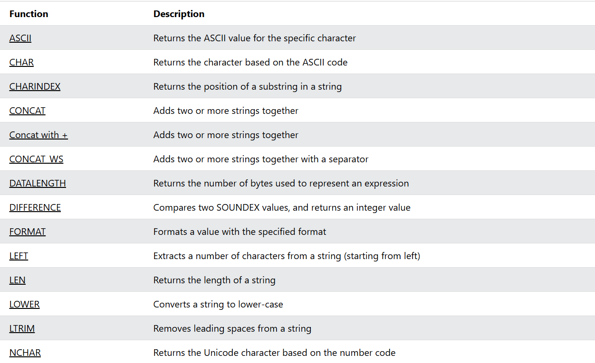

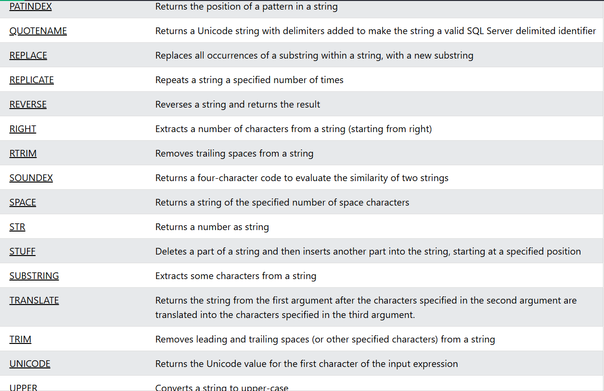


#### SQL Date Data Types
MySQL comes with the following data types for storing a date or a date/time value in the database:

- DATE - format YYYY-MM-DD
- DATETIME - format: YYYY-MM-DD HH:MI:SS
- TIMESTAMP - format: YYYY-MM-DD HH:MI:SS
- YEAR - format YYYY or YY

SQL Server comes with the following data types for storing a date or a date/time value in the database:

- DATE - format YYYY-MM-DD
- DATETIME - format: YYYY-MM-DD HH:MI:SS
- SMALLDATETIME - format: YYYY-MM-DD HH:MI:SS
- TIMESTAMP - format: a unique number

- Note: The date types are chosen for a column when you create a new table in your database!

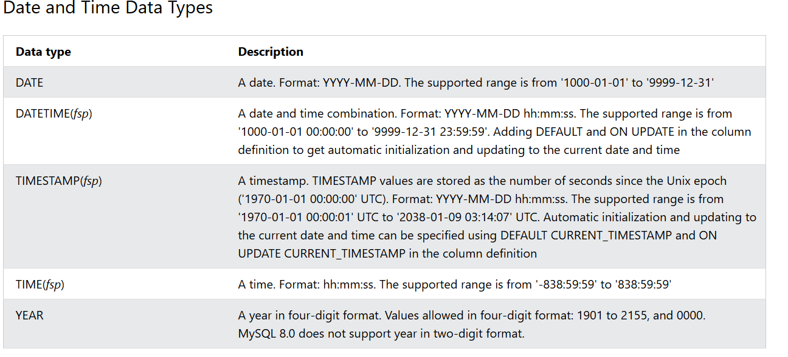

## The SQL CASE Expression
The CASE expression goes through conditions and returns a value when the first condition is met (like an if-then-else statement). So, once a condition is true, it will stop reading and return the result. If no conditions are true, it returns the value in the ELSE clause.

If there is no ELSE part and no conditions are true, it returns NULL.


CASE Syntax:

    CASE
    WHEN condition1 THEN result1
    WHEN condition2 THEN result2
    WHEN conditionN THEN resultN
    ELSE result
    END;


SQL CASE Examples:

The following SQL goes through conditions and returns a value when the first condition is met:

Example:

    SELECT OrderID, Quantity,
    CASE
    WHEN Quantity > 30 THEN 'The quantity is greater than 30'
    WHEN Quantity = 30 THEN 'The quantity is 30'
    ELSE 'The quantity is under 30'
    END AS QuantityText
    FROM OrderDetails;

The following SQL will order the customers by City. However, if City is NULL, then order by Country:

Example:

    SELECT CustomerName, City, Country
    FROM Customers
    ORDER BY
    (CASE
    WHEN City IS NULL THEN Country
    ELSE City
    END);

### SQL IFNULL(), ISNULL(), COALESCE(), and NVL() Functions

MySQL

The MySQL IFNULL() function lets you return an alternative value if an expression is NULL:

    SELECT ProductName, UnitPrice * (UnitsInStock + IFNULL(UnitsOnOrder, 0))
    FROM Products;

or we can use the COALESCE() function, like this:

    SELECT ProductName, UnitPrice * (UnitsInStock + COALESCE(UnitsOnOrder, 0))
    FROM Products;

SQL Server

The SQL Server ISNULL() function lets you return an alternative value when an expression is NULL:

    SELECT ProductName, UnitPrice * (UnitsInStock + ISNULL(UnitsOnOrder, 0))
    FROM Products;

or we can use the COALESCE() function, like this:

    SELECT ProductName, UnitPrice * (UnitsInStock + COALESCE(UnitsOnOrder, 0))
    FROM Products;

MS Access

The MS Access IsNull() function returns TRUE (-1) if the expression is a null value, otherwise FALSE (0):

    SELECT ProductName, UnitPrice * (UnitsInStock + IIF(IsNull(UnitsOnOrder), 0, UnitsOnOrder))
    FROM Products;

Oracle

The Oracle NVL() function achieves the same result:

    SELECT ProductName, UnitPrice * (UnitsInStock + NVL(UnitsOnOrder, 0))
    FROM Products;

or we can use the COALESCE() function, like this:

    SELECT ProductName, UnitPrice * (UnitsInStock + COALESCE(UnitsOnOrder, 0))
    FROM Products;


## IN Operator
The IN operator allows you to specify multiple values in a WHERE clause.

The IN operator is a shorthand for multiple OR conditions.

Return all customers from 'Germany', 'France', or 'UK'

    SELECT * FROM Customers
    WHERE Country IN ('Germany', 'France', 'UK');

#### Syntax:

    SELECT column_name(s)
    FROM table_name
    WHERE column_name IN (value1, value2, ...);

#### NOT IN
By using the NOT keyword in front of the IN operator, you return all records that are NOT any of the values in the list.

#### Example
Return all customers that are NOT from 'Germany', 'France', or 'UK':

    SELECT * FROM Customers
    WHERE Country NOT IN ('Germany', 'France', 'UK');

### IN (SELECT)
You can also use IN with a subquery in the WHERE clause.

With a subquery you can return all records from the main query that are present in the result of the subquery.

##### Example:
Return all customers that have an order in the Orders table:

    SELECT * FROM Customers
    WHERE CustomerID IN (SELECT CustomerID FROM Orders);

### NOT IN (SELECT)
The result in the example above returned 74 records, that means that there are 17 customers that haven't placed any orders.

Let us check if that is correct, by using the NOT IN operator.

#### Example
Return all customers that have NOT placed any orders in the Orders table:

    SELECT * FROM Customers
    WHERE CustomerID NOT IN (SELECT CustomerID FROM Orders);

### BETWEEN Operator
The BETWEEN operator selects values within a given range. The values can be numbers, text, or dates.

The BETWEEN operator is inclusive: begin and end values are included.

#### Example:
Selects all products with a price between 10 and 20:

    SELECT * FROM Products
    WHERE Price BETWEEN 10 AND 20;

#### Syntax:

    SELECT column_name(s)
    FROM table_name
    WHERE column_name BETWEEN value1 AND value2;

### NOT BETWEEN
To display the products outside the range of the previous example, use NOT BETWEEN:

##### Example:

    SELECT * FROM Products
    WHERE Price NOT BETWEEN 10 AND 20;

### BETWEEN with IN
The following SQL statement selects all products with a price between 10 and 20. In addition, the CategoryID must be either 1,2, or 3:

##### Example:

    SELECT * FROM Products
    WHERE Price BETWEEN 10 AND 20
    AND CategoryID IN (1,2,3);

### BETWEEN Text Values
The following SQL statement selects all products with a ProductName alphabetically between Carnarvon Tigers and Mozzarella di Giovanni:

##### Example:

    SELECT * FROM Products
    WHERE ProductName BETWEEN 'Carnarvon Tigers' AND 'Mozzarella di Giovanni'
    ORDER BY ProductName;

The following SQL statement selects all products with a ProductName between Carnarvon Tigers and Chef Anton's Cajun Seasoning:

##### Example:

    SELECT * FROM Products
    WHERE ProductName BETWEEN "Carnarvon Tigers" AND "Chef Anton's Cajun Seasoning"
    ORDER BY ProductName;

### NOT BETWEEN Text Values
The following SQL statement selects all products with a ProductName not between Carnarvon Tigers and Mozzarella di Giovanni:

##### Example:

    SELECT * FROM Products
    WHERE ProductName NOT BETWEEN 'Carnarvon Tigers' AND 'Mozzarella di Giovanni'
    ORDER BY ProductName;

### BETWEEN Dates
The following SQL statement selects all orders with an OrderDate between '01-July-1996' and '31-July-1996':

##### Example

    SELECT * FROM Orders
    WHERE OrderDate BETWEEN #07/01/1996# AND #07/31/1996#;

OR:

##### Example:

    SELECT * FROM Orders
    WHERE OrderDate BETWEEN '1996-07-01' AND '1996-07-31';

## 
SQL Aliases

SQL aliases are used to give a table, or a column in a table, a temporary name.

Aliases are often used to make column names more readable.

An alias only exists for the duration of that query.

An alias is created with the AS keyword.

#### Example:

    SELECT CustomerID AS ID
    FROM Customers;

### AS is Optional
Actually, in most database languages, you can skip the AS keyword and get the same result:

##### Example:

    SELECT CustomerID ID
    FROM Customers;

#### Syntax:
When alias is used on column:

    SELECT column_name AS alias_name
    FROM table_name;

When alias is used on table:

    SELECT column_name(s)
    FROM table_name AS alias_name;

#### Alias for Columns
The following SQL statement creates two aliases, one for the CustomerID column and one for the CustomerName column:

##### Example:

    SELECT CustomerID AS ID, CustomerName AS Customer
    FROM Customers;

#### Using Aliases With a Space Character
If you want your alias to contain one or more spaces, like "My Great Products", surround your alias with square brackets or double quotes.

#### Example:
Using [square brackets] for aliases with space characters:

    SELECT ProductName AS [My Great Products]
    FROM Products;

#### Example:
Using "double quotes" for aliases with space characters:

    SELECT ProductName AS "My Great Products"
    FROM Products;

## Concatenate Columns
The following SQL statement creates an alias named "Address" that combine four columns (Address, PostalCode, City and Country):

#### Example:

    SELECT CustomerName, Address + ', ' + PostalCode + ' ' + City + ', ' + Country AS Address
    FROM Customers;

Note: To get the SQL statement above to work in MySQL use the following:

#### MySQL Example

    SELECT CustomerName, CONCAT(Address,', ',PostalCode,', ',City,', ',Country) AS Address
    FROM Customers;

Note: To get the SQL statement above to work in Oracle use the following:


### Oracle Example:

    SELECT CustomerName, (Address || ', ' || PostalCode || ' ' || City || ', ' || Country) AS Address
    FROM Customers;
    Alias for Tables
The same rules applies when you want to use an alias for a table.

### Example
Refer to the Customers table as Persons instead:

    SELECT * FROM Customers AS Persons;

It might seem useless to use aliases on tables, but when you are using more than one table in your queries, it can make the SQL statements shorter.

The following SQL statement selects all the orders from the customer with CustomerID=4 (Around the Horn). We use the "Customers" and "Orders" tables, and give them the table aliases of "c" and "o" respectively (Here we use aliases to make the SQL shorter):

#### Example:

    SELECT o.OrderID, o.OrderDate, c.CustomerName
    FROM Customers AS c, Orders AS o
    WHERE c.CustomerName='Around the Horn' AND c.CustomerID=o.CustomerID;

The following SQL statement is the same as above, but without aliases:

#### Example:

    SELECT Orders.OrderID, Orders.OrderDate, Customers.CustomerName
    FROM Customers, Orders
    WHERE Customers.CustomerName='Around the Horn' AND Customers.CustomerID=Orders.CustomerID;

Aliases can be useful when:

There are more than one table involved in a query

- Functions are used in the query
- Column names are big or not very readable
- Two or more columns are combined together

## SQL JOIN
A JOIN clause is used to combine rows from two or more tables, based on a related column between them.

Example:

    SELECT Orders.OrderID, Customers.CustomerName, Orders.OrderDate
    FROM Orders
    INNER JOIN Customers ON Orders.CustomerID=Customers.CustomerID;

#### Different Types of SQL JOINs
Here are the different types of the JOINs in SQL:

- (INNER) JOIN: Returns records that have matching values in both tables
- LEFT (OUTER) JOIN: Returns all records from the left table, and the matched records from the right table
- RIGHT (OUTER) JOIN: Returns all records from the right table, and the matched records from the left table
- FULL (OUTER) JOIN: Returns all records when there is a match in either left or right table

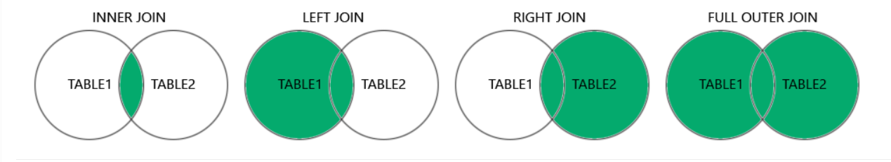

### INNER JOIN
The INNER JOIN keyword selects records that have matching values in both tables.

Example:

Join Products and Categories with the INNER JOIN keyword:

    SELECT ProductID, ProductName, CategoryName
    FROM Products
    INNER JOIN Categories ON Products.CategoryID = Categories.CategoryID;


Note: The INNER JOIN keyword returns only rows with a match in both tables. Which means that if you have a product with no CategoryID, or with a CategoryID that is not present in the Categories table, that record would not be returned in the result.

Syntax:

    SELECT column_name(s)
    FROM table1
    INNER JOIN table2
    ON table1.column_name = table2.column_name;

#### Naming the Columns
It is a good practice to include the table name when specifying columns in the SQL statement.

Example:

Specify the table names:

    SELECT Products.ProductID, Products.ProductName, Categories.CategoryName
    FROM Products
    INNER JOIN Categories ON Products.CategoryID = Categories.CategoryID;

The example above works without specifying table names, because none of the specified column names are present in both tables. If you try to include CategoryID in the SELECT statement, you will get an error if you do not specify the table name (because CategoryID is present in both tables).

### JOIN or INNER JOIN
JOIN and INNER JOIN will return the same result.

INNER is the default join type for JOIN, so when you write JOIN the parser actually writes INNER JOIN.

Example:

JOIN is the same as INNER JOIN:

    SELECT Products.ProductID, Products.ProductName, Categories.CategoryName
    FROM Products
    JOIN Categories ON Products.CategoryID = Categories.CategoryID;

#### JOIN Three Tables
The following SQL statement selects all orders with customer and shipper information:

Example:

    SELECT Orders.OrderID, Customers.CustomerName, Shippers.ShipperName
    FROM ((Orders
    INNER JOIN Customers ON Orders.CustomerID = Customers.CustomerID)
    INNER JOIN Shippers ON Orders.ShipperID = Shippers.ShipperID);

#### SQL LEFT JOIN Keyword
The LEFT JOIN keyword returns all records from the left table (table1), and the matching records from the right table (table2). The result is 0 records from the right side, if there is no match.

LEFT JOIN Syntax:

    SELECT column_name(s)
    FROM table1
    LEFT JOIN table2
    ON table1.column_name = table2.column_name;

Note: In some databases LEFT JOIN is called LEFT OUTER JOIN.

Example:

    SELECT Customers.CustomerName, Orders.OrderID
    FROM Customers
    LEFT JOIN Orders ON Customers.CustomerID = Orders.CustomerID
    ORDER BY Customers.CustomerName;

Note: The LEFT JOIN keyword returns all records from the left table (Customers), even if there are no matches in the right table (Orders).

### SQL RIGHT JOIN Keyword
The RIGHT JOIN keyword returns all records from the right table (table2), and the matching records from the left table (table1). The result is 0 records from the left side, if there is no match.

RIGHT JOIN Syntax:

    SELECT column_name(s)
    FROM table1
    RIGHT JOIN table2
    ON table1.column_name = table2.column_name;

Note: In some databases RIGHT JOIN is called RIGHT OUTER JOIN.

SQL RIGHT JOIN Example:

The following SQL statement will return all employees, and any orders they might have placed:

Example:

    SELECT Orders.OrderID, Employees.LastName, Employees.FirstName
    FROM Orders
    RIGHT JOIN Employees ON Orders.EmployeeID = Employees.EmployeeID
    ORDER BY Orders.OrderID;

### SQL FULL OUTER JOIN Keyword:

The FULL OUTER JOIN keyword returns all records when there is a match in left (table1) or right (table2) table records.

Tip: FULL OUTER JOIN and FULL JOIN are the same.

FULL OUTER JOIN Syntax:

    SELECT column_name(s)
    FROM table1
    FULL OUTER JOIN table2
    ON table1.column_name = table2.column_name
    WHERE condition;


SQL FULL OUTER JOIN Example:

The following SQL statement selects all customers, and all orders:

    SELECT Customers.CustomerName, Orders.OrderID
    FROM Customers
    FULL OUTER JOIN Orders ON Customers.CustomerID=Orders.CustomerID
    ORDER BY Customers.CustomerName;

Note: The FULL OUTER JOIN keyword returns all matching records from both tables whether the other table matches or not. So, if there are rows in "Customers" that do not have matches in "Orders", or if there are rows in "Orders" that do not have matches in "Customers", those rows will be listed as well.

### SQL Self Join
A self join is a regular join, but the table is joined with itself.

Self Join Syntax:

    SELECT column_name(s)
    FROM table1 T1, table1 T2
    WHERE condition;

SQL Self Join Example:

The following SQL statement matches customers that are from the same city:

Example :

    SELECT A.CustomerName AS CustomerName1, B.CustomerName AS CustomerName2, A.City
    FROM Customers A, Customers B
    WHERE A.CustomerID <> B.CustomerID
    AND A.City = B.City
    ORDER BY A.City;

## SubQuery:
A subquery in SQL is a query nested inside another SQL query. It allows complex filtering, aggregation and data manipulation by using the result of one query inside another. They are an essential tool when we need to perform operations like:

- Filtering: selecting rows based on conditions from another query.
- Aggregating: applying functions like SUM, COUNT, AVG with dynamic conditions.
- Updating: modifying data using values from other tables.
- Deleting: removing rows based on criteria from another query.


While there is no universal syntax for subqueries, they are commonly used in SELECT statements as follows.

Syntax:

    SELECT column_name
    FROM table_name
    WHERE column_name expression operator
    (SELECT column_name FROM table_name WHERE ...);

Common SQL Clauses for Subqueries
Clauses that can be used with subqueries are:

- WHERE: filter rows based on subquery results.

- FROM: treat subquery as a temporary (derived) table.

- HAVING: filter aggregated results after grouping.

### Types of Subqueries
1. Single-Row Subquery
   Returns exactly one row as the result.

   Commonly used with comparison operators such as =, >, <

   Example:

        SELECT * FROM Employees
        WHERE Salary = (SELECT MAX(Salary) FROM Employees);

Output: Returns the employee(s) with the highest salary.

2. Multi-Row Subquery:

   Returns multiple rows as the result.
   Requires operators that can handle multiple values, such as IN, ANY or ALL

   Example:

        SELECT * FROM Employees
        WHERE DepartmentID IN (SELECT DepartmentID FROM Departments WHERE Location = 'New York');

Output: Fetches employees working in all New York departments.

3. Correlated Subquery:

   A dependent subquery: it references columns from the outer query.
   Executed once for each row of the outer query, making it slower for large datasets.

Example:

    SELECT e.Name, e.Salary
    FROM Employees e
    WHERE e.Salary > (SELECT AVG(Salary)
    FROM Employees
    WHERE DepartmentID = e.DepartmentID);

Output: Returns employees earning more than the average salary of their own department.

Example 1: Fetching Data Using Subquery in WHERE Clause

This example demonstrates how to use a subquery inside the WHERE clause. The inner query retrieves roll numbers of students who belong to section 'A' and the outer query fetches their corresponding details (name, location and phone number) from the Student table.

Query:

    SELECT NAME, LOCATION, PHONE_NUMBER
    FROM Student
    WHERE ROLL_NO IN (
    SELECT ROLL_NO FROM New_Student WHERE SECTION = 'A');

Example 3: Using Subquery with DELETE

In this example, we use a subquery with DELETE to remove certain rows from the Student table. Instead of hardcoding roll numbers, the subquery finds them based on conditions.

Query:

    DELETE FROM Student
    WHERE ROLL_NO IN (
    SELECT ROLL_NO FROM Student WHERE ROLL_NO <= 101 OR ROLL_NO = 201);

Example 4: Using Subquery with UPDATE

Subqueries can also be used with UPDATE. In this example, we update student names to "Geeks" if their location matches the result of a subquery.

Query:

    UPDATE Student
    SET NAME = 'Geeks'
    WHERE LOCATION IN (
    SELECT LOCATION FROM Student WHERE LOCATION IN ('Salem', 'Delhi') );

Example 5: Simple Subquery in the FROM Clause

This example demonstrates using a subquery inside the FROM clause, where the subquery acts as a temporary (derived) table.

Query:

    SELECT NAME, PHONE_NUMBER
    FROM (
    SELECT NAME, PHONE_NUMBER, LOCATION
    FROM Student
    WHERE LOCATION LIKE 'C%'
    ) AS subquery_table;

Example 6: Subquery with JOIN
We can also use subqueries along with JOIN to connect data across tables.

Query:

    SELECT s.NAME, s.LOCATION, ns.SECTION
    FROM Student s
    INNER JOIN (
    SELECT ROLL_NO, SECTION
    FROM New_Student WHERE SECTION = 'A'
    ) ns
    ON s.ROLL_NO = ns.ROLL_NO;

## PARTITION BY :
A PARTITION BY clause is used to partition rows of table into groups. It is useful when we have to perform a calculation on individual rows of a group using other rows of that group.

- It is always used inside OVER() clause.

- The partition formed by partition clause are also known as Window.

- This clause works on windows functions only. Like- RANK(), LEAD(), LAG() etc.

- If this clause is omitted in OVER() clause, then whole table is considered as a single partition.


Syntax: The syntax for Partition clause is-

    Window_function ( expression )
    Over ( partition by expr [order_clause] [frame_clause] )

Here, order_clause and frame_clause are optional.

expr can be column names or built-in functions in MySQL.

But, standard SQL permits only column names in expr.


Example:

We have to find the rank of hackers in each challenge. That means we have to list all participated hackers of a challenge along with their rank in that challenge.

Query:

    select challenge_id, h_id, h_name, score,
    dense_rank() over ( partition by challenge_id order by score desc )
    as "rank", from hacker;

Explanation:

In the above query, partition by clause will partition table into groups that are having same challenge_id.

order by will arrange the hackers of each partition in descending order by "scores".

over() clause defines how to partition and order rows of table, which is to be processed by window function rank().

dense_rank() is a window function, which will assign rank in ordered partition of challenges. If two hackers have same scores then they will be assigned same rank.


## Stored Procedure
Stored procedures are precompiled SQL statements that are stored in the database and can be executed as a single unit. SQL Stored Procedures are a powerful feature in database management systems (DBMS) that allow developers to encapsulate SQL code and business logic. When executed, they can accept input parameters and return output, acting as a reusable unit of work that can be invoked multiple times by users, applications, or other procedures.

What is a SQL Stored Procedure?

A SQL Stored Procedure is a collection of SQL statements bundled together to perform a specific task. These procedures are stored in the database and can be called upon by users, applications, or other procedures. Stored procedures are essential for automating database tasks, improving efficiency, and reducing redundancy. By encapsulating logic within stored procedures, developers can streamline their workflow and enforce consistent business rules across multiple applications and systems.

Syntax:

    CREATE PROCEDURE procedure_name
    (parameter1 data_type, parameter2 data_type, ...)
    AS
    BEGIN
    -- SQL statements to be executed
    END

Key Terms

CREATE PROCEDURE: This keyword creates the stored procedure with the given name.

@parameter1, @parameter2: These are input parameters that allow you to pass values into the stored procedure.

BEGIN...END: These keywords define the block of SQL statements that make up the procedure body.

#### Types of SQL Stored Procedures
SQL stored procedures are categorized into different types based on their use case and functionality. Understanding these categories can help developers choose the right type of procedure for specific scenario

1. System Stored Procedures:

These are predefined stored procedures provided by the SQL Server for performing administrative tasks such as database management, troubleshooting, or system configuration. Examples include:

sp_help for viewing database object information

sp_rename for renaming database objects.

3. User-Defined Stored Procedures (UDPs)

These are custom stored procedures created by the user to perform specific operations. User-defined stored procedures can be tailored to a business's needs, such as calculating totals, processing orders, or generating reports. For example, creating a procedure that calculates the total sales for a particular product category.

4. Extended Stored Procedures

These allow for the execution of external functions, which might be implemented in other languages such as C or C++. Extended procedures provide a bridge between SQL Server and external applications or tools, such as integrating third-party tools into SQL Server.

4. CLR Stored Procedures
   These are stored procedures written in .NET languages (like C#) and executed within SQL Server. CLR stored procedures are useful when advanced functionality is needed that isn't easily achievable with T-SQL alone, such as complex string manipulation or working with external APIs.

Why Use SQL Stored Procedures?

There are several key reasons why SQL Stored Procedures are widely used in database management:

Performance Optimization: Since stored procedures are precompiled, they execute faster than running ad-hoc SQL queries. The database engine can reuse the execution plan, eliminating the need for repeated query parsing and optimization.

Security and Data Access Control: By using stored procedures, developers can restrict direct access to sensitive data. Users can execute procedures without accessing the underlying tables, helping to protect critical information.

Code Reusability and Maintainability: SQL stored procedures can be reused in multiple applications or different parts of an application. This reduces the need to rewrite complex queries repeatedly.

Reduced Network Traffic: Instead of sending multiple individual queries to the database server, stored procedures allow you to execute multiple operations in one go, reducing network load.

Maintainability: Stored procedures simplify code maintenance. Changes made to the procedure are automatically reflected wherever the procedure is used, making it easier to manage complex logic.

Example of Creating a Stored Procedure:

In this example, we create a stored procedure called GetCustomersByCountry, which accepts a Country parameter and returns the CustomerName and ContactName for all customers from that country. The procedure is designed to query the Customers table, which contains customer information, including their names, contact details, and country.


By passing a country as a parameter, the stored procedure dynamically fetches the relevant customer details from the table

Query:

    -- Create a stored procedure named "GetCustomersByCountry"
    CREATE PROCEDURE GetCustomersByCountry
    @Country VARCHAR(50)
    AS
    BEGIN
    SELECT CustomerName, ContactName
    FROM Customers
    WHERE Country = @Country;
    END;
    -- Execute the stored procedure with parameter "Sri lanka"
    EXEC GetCustomersByCountry @Country = 'Sri lanka';

Note: We will need to make sure that the user account has the necessary privileges to create a database. We can try logging in as a different user with administrative privileges or contact the database administrator to grant the necessary privileges to our user account. If we are using a cloud-based database service, make sure that we have correctly configured the user account and its permissions.


#### Advantages of Using SQL Stored Procedures
- Improved Performance: Stored procedures are precompiled, meaning they execute faster than running multiple individual queries.

- Enhanced Security: Users can be granted permission to execute stored procedures without directly accessing the underlying tables.

- Code Reusability: Stored procedures allow for reusability, making it easier to maintain and update code.

- Reduced Network Traffic: By bundling multiple SQL statements into one call, stored procedures reduce network load and improve application performance.

- Better Error Handling: SQL stored procedures provide a structured way to manage errors using TRY...CATCH blocks.

#### Real-World Use Cases for SQL Stored Procedures

- Order Processing System In an e-commerce application, a stored procedure can automate the process of inserting new orders, updating stock levels, and generating invoices.

- Employee Management System A stored procedure can be used to calculate salaries for employees, deduct taxes, and generate monthly salary slips.

- Data Validation Use stored procedures to validate data before it’s inserted into the database. For example, checking if an email address already exists before adding a new user.

- Audit Logs Create a stored procedure that automatically logs changes to sensitive data, such as changes to user roles or permissions, for security and auditing purposes.

#### Best Practices for Writing SQL Stored Procedures

1. Keep Procedures Simple and Modular

   Avoid making stored procedures too complex. Break up larger tasks into smaller, more manageable procedures that can be combined as needed. This improves readability and maintainability.

2. Use Proper Error Handling

   Always use TRY...CATCH blocks to handle exceptions gracefully. This ensures that errors are caught and logged, and the procedure can handle unexpected scenarios without crashing.

3. Limit the Use of Cursors

   While cursors can be useful, they are often less efficient than set-based operations. Use cursors only when necessary, and consider alternatives like WHILE loops or CTEs (Common Table Expressions).

4. Avoid Hardcoding Values

   Instead of hardcoding values directly in stored procedures, use parameters to make procedures more flexible and reusable across different contexts.

5. Optimize for Performance

   Consider indexing, query optimization, and avoiding unnecessary joins within stored procedures. Well-optimized queries in stored procedures ensure that performance does not degrade as the database grows.

# SQL TIPS & TRICKS


# 1 -  Where Clause vs Having Clause

## Let's first Create an Employee Table

```sql

    CREATE TABLE employee (
        emp_id INT PRIMARY KEY AUTO_INCREMENT,
        department_id INT,
        salary DECIMAL(10, 2),
        emp_name VARCHAR(100),
        manager_id INT,
        CONSTRAINT fk_manager
            FOREIGN KEY (manager_id)
            REFERENCES employee(emp_id)
    );

    INSERT INTO employee (department_id, salary, emp_name, manager_id)
    VALUES
        (1, 50000.00, 'John Doe', NULL),
        (1, 60000.00, 'Jane Smith', 1),
        (2, 55000.00, 'Michael Johnson', NULL),
        (2, 70000.00, 'Emily Brown', 3),
        (1, 45000.00, 'Robert Lee', 1),
        (3, 80000.00, 'Jessica Davis', NULL),
        (3, 75000.00, 'William Wilson', 6),
        (2, 60000.00, 'Linda Anderson', 3),
        (1, 48000.00, 'James White', 1),
        (3, 72000.00, 'Karen Martinez', 6);

```

* Where clause use to filter the data row by row - which means the keyword iteratively check for each row according to the filter condition.

```sql
  
select * from employee 
where salary > 60000 ;

```
---

* Having clause is used on aggregated values

```sql


select department_id, avg(salary) from employee
group by department_id having avg(salary) > 30000;

```

---

* while using both keep in mind where should be used first then do having !

```sql


select department_id ,avg(salary) from employee
where salary > 60000 group by department_id having avg(salary)>30000;

```
  
---
---

# 2 - SQL Convert Rows to Columns and Columns to Rows without using Pivot Functions

## Create Table ~

```sql
create table emp_compensation (
emp_id int,
salary_component_type varchar(20),
val int
);
insert into emp_compensation
values (1,'salary',10000),(1,'bonus',5000),(1,'hike_percent',10)
, (2,'salary',15000),(2,'bonus',7000),(2,'hike_percent',8)
, (3,'salary',12000),(3,'bonus',6000),(3,'hike_percent',7);


select * from emp_compensation;

```

## Converting rows to columns, also known as pivoting

```sql
select emp_id,
sum(case when salary_component_type = 'salary' then val end  ) as salary,
sum(case when salary_component_type = 'hike_percent' then val end) as hike_percent,
sum(case when salary_component_type = 'bonus' then val end ) as bonus
from emp_compensation
group by emp_id;

```

## Making a new table generated using above query

``` sql
create table  emp_compensation_unpivot as 
select emp_id,
sum(case when salary_component_type = 'salary' then val end  ) as salary,
sum(case when salary_component_type = 'hike_percent' then val end) as hike_percent,
sum(case when salary_component_type = 'bonus' then val end ) as bonus
from emp_compensation
group by emp_id;

```

## Converting columns to rows, also known as unpivoting

```sql

select * from(
select emp_id, 'salary' as salary_component_type, salary as val from emp_compensation_unpivot
union all
select emp_id, 'hike_percent' as salary_component_type, hike_percent as val from emp_compensation_unpivot
union all
select emp_id, 'bonus' as salary_component_type, bonus as val from emp_compensation_unpivot

) as temp order by emp_id;

```

---
---
# 3 - Top 10 SQL interview Questions and Answers | Frequently asked SQL interview questions.

## Create the 'emp' table

```sql
CREATE TABLE sampletable (
    emp_id INT,
    emp_name VARCHAR(20),
    department_id INT,
    salary INT,
    manager_id INT,
    emp_age INT
);
```

## Insert data into the 'emp' table

```sql

INSERT INTO sampletable (emp_id, emp_name, department_id, salary, manager_id, emp_age)
VALUES
    (1, 'Ankit', 100, 10000, 4, 39),
    (2, 'Mohit', 100, 15000, 5, 48),
    (3, 'Vikas', 100, 10000, 4, 37),
    (4, 'Rohit', 100, 5000, 2, 16),
    (5, 'Mudit', 200, 12000, 6, 55),
    (6, 'Agam', 200, 12000, 2, 14),
    (7, 'Sanjay', 200, 9000, 2, 13),
    (8, 'Ashish', 200, 5000, 2, 12),
    (9, 'Mukesh', 300, 6000, 6, 51),
    (10, 'Rakesh', 300, 7000, 6, 50);
    
```

## inserting a duplicate

``` sql

    insert into sampletable(emp_id, emp_name, department_id, salary, manager_id, emp_age)
    values( 1, 'Aman', 400, 5000, 2, 50);

```

## table structure

```sql

    select * from sampletable;

```

## Q1. How to find duplicate in a given table

```sql

    select emp_id , count(1) from sampletable group by emp_id having count(1) > 1 ;

```

## Q2. How to delete duplicates ~ (Works in MYSQL Server)

```sql
			
	with cte as (select *,   row_number() over(partition by emp_id  order by emp_id) as rn from sampletable) 
    delete  from cte where rn >1;
    
```

## Q3. Difference between union and union all

* when we do "union all" - between two queries it will give summation of both results , kind of merging the tables
* whereas , when "union" is used - it will remove duplicates and give unique entries as a final result


## Q4. Difference rank , row_number and dense_rank

* Checkout previous readme's of mine for explanation !


## Q5. Employees who are not present in department table


* let's us first create our department table

 ```sql
    
    -- Create the department table
    
		CREATE TABLE department (
			dept_id INT PRIMARY KEY,
			dept_name VARCHAR(255)
		);
```
* Insert two records

```sql
		INSERT INTO department (dept_id, dept_name) VALUES (100, 'Analytics');
		INSERT INTO department (dept_id, dept_name) VALUES (300, 'IT');


		  select * from sampletable;
		  select * from department;
		  select * from sampletable where department_id not in ( select dept_id from department);

```

* or we can use Left join as to optimise the above sub query

```sql
      select sampletable.* , department.dept_id , department.dept_name from sampletable
      left join department on sampletable.department_id = department.dept_id where department.dept_name is null;

```

## Q6. Second highest salary in each department


```sql

	select * from(
	select   sampletable.*,  dense_rank() over(partition by department_id order by salary desc) as rn from sampletable

	) as temp where temp.rn = 2;

```


## Q7. Find all transaction done by shilpa


```sql

 create orders table - 
 CREATE TABLE orders (
    order_id INT AUTO_INCREMENT PRIMARY KEY,
    customer_name VARCHAR(255),
    order_date DATE,
    order_amount DECIMAL(10, 2),
    customer_gender ENUM('Male', 'Female', 'Other')
);

```

```sql

INSERT INTO orders (customer_name, order_date, order_amount, customer_gender)
VALUES
    ('Shilpa', '2020-01-01', 10000, 'Male'),
    ('Rahul', '2020-01-02', 12000, 'Female'),
    ('SHILPA', '2020-01-02', 12000, 'Male'),
    ('Rohit', '2020-01-03', 15000, 'Female'),
    ('shilpa', '2020-01-03', 14000, 'Male');

```

```sql


select * from orders where UPPER(customer_name) = 'SHILPA';


```

## Q8. self join , manager salary > emp salary

```sql


  select * from sampletable;
  
  select t1.emp_name , t1.salary from sampletable t1 JOIN
  sampletable t2 on t1.manager_id = t2.emp_id where t1.salary > t2.salary;


```

## Q9. Joins left Join/ Inner Join

* Inner Join: Combines matching rows from both tables based on a condition, excluding non-matching rows.
* Left Join: Combines all rows from the left table with matching rows from the right table; non-matching rows from the left table have null values.
* Right Join: Combines all rows from the right table with matching rows from the left table; non-matching rows from the right table have null values.


## Q10. Update query to swap gender


```sql

SET SQL_SAFE_UPDATES = 0;

UPDATE orders
SET customer_gender = CASE
    WHEN customer_gender = 'Male' THEN 'Female'
    WHEN customer_gender = 'Female' THEN 'Male'
    ELSE customer_gender  -- Include this line if you want to keep other values as they are
END;

select * from orders;

```

---
---

# 4 -  SQL Self Join Concept | Most Asked Interview Question | Employee Salary More than Manager's Salary


```sql

  select * from sampletable;
  
  select t1.emp_name , t1.salary from sampletable t1 JOIN
  sampletable t2 on t1.manager_id = t2.emp_id where t1.salary > t2.salary;

```

# 5 - How to Practice SQLs Without Creating Tables In Your Database


```sql


with emp1 as
(
select 1 as emp_id, 1000 as emp_salary, 1 as dep_id
union all select 2 as emp_id, 2000 as emp_salary, 2 as dep_id
union all select 3 as emp_id ,3000 as emp_salary, 3 as dep_id
union all select 4 as emp_id ,4000 as emp_salary, 4 as dep_id
),
dep as
(
select 1 as dep_id ,'d1' as dep_name
union all select 2 as dep_id, 'd1' as dep_name
union all select 3 as dep_id, 'd2' as dep_name
union all select 4 as dep_id, 'd3' as dep_name
)
select* from emp;

```
---
---

# 6 - SQL Cross Join | Use Cases | Master Data | Performance Data


## Create Required Tables used in the video -

```sql

create table products (
id int,
name varchar(10)
);
insert into products VALUES 
(1, 'A'),
(2, 'B'),
(3, 'C'),
(4, 'D'),
(5, 'E');


create table colors (
color_id int,
color varchar(50)
);
insert into colors values (1,'Blue'),(2,'Green'),(3,'Orange');


create table sizes
(
size_id int,
size varchar(10)
);

insert into sizes values (1,'M'),(2,'L'),(3,'XL');


create table transactions
(
order_id int,
product_name varchar(20),
color varchar(10),
size varchar(10),
amount int
);
insert into transactions values (1,'A','Blue','L',300),(2,'B','Blue','XL',150),(3,'B','Green','L',250),(4,'C','Blue','L',250),
(5,'E','Green','L',270),(6,'D','Orange','L',200),(7,'D','Green','M',250);

```

* First use case is to produce master data for a fact table

```sql


select * from transactions;

select product_name, color, size, sum(amount) as totalamount
from transactions
group by product_name, color, size;

with master_data as (select p.name as product_name ,  c.color , s.size from products p , colors c , sizes s)
, sales as (select product_name, color, size , sum(amount) as totalamount
from transactions
group by product_name, color, size)
select md.product_name, md.color, md.size  , ifnull(s.totalamount,0) as totalamount from master_data md
LEFT join sales  s on md.product_name=s.product_name and md.color=s.color and md.size = s.size order by totalamount;

```

* Second use case is when you want to generate large no of records for performance testing.
* Code shown below is just a example like how we can join table with large records to make a large dataset and manipulate calculations


```sql


select row_number() over (order by t.order_id) as order_id, t.product_name, t. color,
case when row_number() over (order by t.order_id) %3=0 then 'L' else 'XL'end size
,t.amount from transactions t;

```

---
---

# 7 - Most Asked SQL JOIN based Interview Question | # of Records after 4 types of JOINs

## interview question: no of records with diffrent kinds of joins when there are duplicate key values

```sql

create table t1 ( a  INT  ) ;
create table t2 ( b  INT  ) ;

Insert into t1 values(1);
Insert into t1 values(1);

Insert into t2 values(1);
Insert into t2 values(1);
Insert into t2 values(1);

select  * from t1;
select * from t2;

```

* Inner join

```sql

select * from t1 inner join t2 on t1.a = t2.b;

```
* Left Join

```sql

select * from t1 left join t2 on t1.a = t2.b;

```
* Right Join

```sql

select * from t1 right join t2 on t1.a = t2.b;

```
* Full Outer Join

```sql
 
select * from t1 full outer join t2 on t1.a = t2.b;

```

* point to be noted null != null , we can't join on this condition

---
---

# 8 - How to Calculate Mode in SQL | How to Find Most Frequent Value in a Column

```sql

create table modes ( temp INT);
insert into modes values(1);
insert into modes values(2);
insert into modes values(2);
insert into modes values(2);
insert into modes values(3);
insert into modes values(4);
insert into modes values(5);
insert into modes values(5);
insert into modes values(7);
insert into modes values(7);
insert into modes values(8);

select * from modes;

```

# Query to find mode -

* Method 1 - Using CTE -

```sql

with freq_cte as (
select temp , count(*) as freq from modes group by temp) 
select * from freq_cte where freq = (select max(freq) from freq_cte);

```

* Method 2 - Using Rank Function -

```sql

select temp , row_number() over(partition by temp order by temp desc) from modes; 

with freq_cte as ( select temp , count(*) as freq from modes group by temp) ,
rnk_cte as (select * , rank() over(order by freq desc) as rn from freq_cte)
select * from rnk_cte where rn= 1;

```


---
---

# 9 -  SQL Interview Question Based on Full Outer Join | Asked in Deloitte


# Create required tables

```sql

create table emp_2020
(
emp_id int,
designation varchar(20)
);

create table emp_2021
(
emp_id int,
designation varchar(20)
);

insert into emp_2020 values (1,'Trainee'), (2,'Developer'),(3,'Senior Developer'),(4,'Manager');
insert into emp_2021 values (1,'Developer'), (2,'Developer'),(3,'Manager'),(5,'Trainee');

select * from emp_2020 ;
select * from emp_2021;

```

* Full outer join dosen't work in mysql so make a union between left and right join

```sql

select e20.* , e21.*  from emp_2020 e20  
left  join emp_2021 e21  on e20.emp_id = e21.emp_id

union

select e20.* , e21.*  from emp_2020 e20  
right  join emp_2021 e21  on e20.emp_id = e21.emp_id;

```

* Query - ( Used combination of joins as full outer join not works in Mysql)

``` sql

select ifnull(e20.emp_id , e21.emp_id) as emp_id , case 
when e21.designation != e20.designation then 'Promoted'
when e21.designation is null then 'Resigned'
else 'New' end 
as comment

from emp_2020 e20  

left join emp_2021 e21 on e20.emp_id = e21.emp_id where ifnull(e20.designation, 'xxx') != ifnull(e21.designation, 'yyy')

union

select ifnull(e20.emp_id , e21.emp_id) as emp_id , case 
when e21.designation != e20.designation then 'Promoted'
when e21.designation is null then 'Resigned'
else 'New' end 
as comment

from emp_2020 e20  

right join emp_2021 e21 on e20.emp_id = e21.emp_id where ifnull(e20.designation, 'xxx') != ifnull(e21.designation, 'yyy');

```

---
---


# 10 - A Simple and Tricky SQL Question | Rank Only Duplicates | SQL Interview Questions

``` sql

create table list (id varchar(5));
insert into list values ('a');
insert into list values ('a');
insert into list values ('b');
insert into list values ('c');
insert into list values ('c');
insert into list values ('c');
insert into list values ('d');
insert into list values ('d');
insert into list values ('e');

select * from list;

```

``` sql
with cte_duplicates as (
select * from list group by id having count(1)>1 ),
cte_rank as (
select id,rank() over(order by id) as rnk from cte_duplicates )
select l.id, cr.rnk  from list l left join cte_rank cr on l.id = cr.id

```

---
---


# 11 - Master SQL UPDATE Statement | SQL UPDATE A-Z Tutorial | SQL Update with JOIN


```sql 
create database ankit_sql;

CREATE TABLE EmployeeData (
    emp_id INT PRIMARY KEY,
    emp_name VARCHAR(255),
    salary DECIMAL(10, 2),
    manager_id INT,
    emp_age INT,
    dept_id INT
);

INSERT INTO EmployeeData (emp_id, emp_name, salary, manager_id, emp_age, dept_id)
VALUES
    (1, 'John Doe', 60000.00, NULL, 30, 101),
    (2, 'Jane Smith', 55000.00, 1, 28, 101),
    (3, 'Michael Johnson', 70000.00, 1, 32, 102),
    (4, 'Emily Davis', 62000.00, 1, 29, 102),
    (5, 'William Brown', 58000.00, 3, 31, 103),
    (6, 'Olivia Wilson', 56000.00, 3, 27, 103),
    (7, 'James Taylor', 75000.00, 1, 35, 104),
    (8, 'Sophia Martinez', 63000.00, 7, 30, 104),
    (9, 'Alexander Anderson', 60000.00, 7, 29, 105),
    (10, 'Ava Rodriguez', 57000.00, 7, 28, 105);
    
    
CREATE TABLE DepartmentData (
    dept_id INT PRIMARY KEY,
    dept_name VARCHAR(255)
);

INSERT INTO DepartmentData (dept_id, dept_name)
VALUES
    (101, 'Human Resources'),
    (102, 'Marketing'),
    (103, 'Engineering'),
    (104, 'Finance'),
    (105, 'Sales');


select * from EmployeeData;
select * from DepartmentData;

```


# Update syntax for single value update


```sql

SET SQL_SAFE_UPDATES = 0;

update EmployeeData set salary = 10000 ;

```


# Update syntax with where clause


```sql


update EmployeeData set salary = 12000 where emp_age> 30  ;


```

# Update multiple values

```sql

update  EmployeeData set salary = 12000 , dept_id = 104 where emp_id =  32 ;


```

# Update col with constant values or derived calculations - ( aggregations / case when statement )

```sql


update EmployeeData set salary = case when dept_id = 101 then salary*1.1  when dept_id = 104  then salary*1.2 else salary end;


```


# Update statement using join - here we will see how to join dept name from DepartmentData table to EmployeeData ( Workbench - MySql)


* Adding a new column dept_name in employee table - initially all values will be null

```sql

alter table EmployeeData add dept_name varchar(20);

```

# Update using join

```sql

update EmployeeData e
inner join DepartmentData d on e.dept_id=d.dept_id set e.dept_name=d.dept_name;


```

# Interview question on swapping the genders -

* let's first add a gender column in EmployeeData Table

```sql

alter table EmployeeData add gender varchar(15);

```

```sql

update employeedata set gender = case when dept_id = 101 then 'Male' when dept_id = 103 then 'Female' else 'Male' end;
select * from employeedata;

```


# Swap gender ~

```sql


update employeedata set gender = case when gender = 'Male' then 'Female' when gender = 'Female' then 'Male' end;


```

* note - here above we can't use two update statements as - neccessity is to use  - case when for desired output


# Steps to check before making updating the database - convert it into select statement to get a run time overview  -

```sql

select * , case when gender = 'Male' then 'Female' when gender = 'Female' then 'Male' end  as updated_gender from employeedata;

```

---
---


# 12 - Slowly Changing Dimensions In Data warehousing with iPhone 11 Example | SCD 1/2/3

* Watch video for expalanation - [Link](https://youtu.be/ejdIgYPfcV4?si=Ro5YAye2fWMO06mb)

---
---

# 13 -  Custom Sort Trick in SQL | Sorting Happiness Index Data with India on Top | SQL Interview Question


```sql

 /* CREATE TABLE */
CREATE TABLE IF NOT EXISTS TABLE_NAME(
Ranks INT(11),
Country VARCHAR( 100 ),
Happiness_2021  DECIMAL( 10 , 2 ),
Happiness_2020 DECIMAL( 10 , 2 ),
2022_Population INT(11)
);

/* INSERT QUERY */
INSERT INTO TABLE_NAME( Ranks,Country,Happiness_2021 ,Happiness_2020,2022_Population )
VALUES
(
    1,'Finland',7.842,7.809,5554960
);

/* INSERT QUERY */
INSERT INTO TABLE_NAME( Ranks,Country,Happiness_2021 ,Happiness_2020,2022_Population )
VALUES
(
    2,'Denmark',7.62,7.646,5834950
);

/* INSERT QUERY */
INSERT INTO TABLE_NAME( Ranks,Country,Happiness_2021 ,Happiness_2020,2022_Population )
VALUES
(
    3,'Switzerland',7.571,7.56,8773637
);

/* INSERT QUERY */
INSERT INTO TABLE_NAME( Ranks,Country,Happiness_2021 ,Happiness_2020,2022_Population )
VALUES
(
    4,'Iceland',7.554,7.504,345393
);

/* INSERT QUERY */
INSERT INTO TABLE_NAME( Ranks,Country,Happiness_2021 ,Happiness_2020,2022_Population )
VALUES
(
    5,'Netherlands',7.464,7.449,17211447
);

/* INSERT QUERY */
INSERT INTO TABLE_NAME( Ranks,Country,Happiness_2021 ,Happiness_2020,2022_Population )
VALUES
(
    6,'Norway',7.392,7.488,5511370
);

/* INSERT QUERY */
INSERT INTO TABLE_NAME( Ranks,Country,Happiness_2021 ,Happiness_2020,2022_Population )
VALUES
(
    7,'Sweden',7.363,7.353,10218971
);

/* INSERT QUERY */
INSERT INTO TABLE_NAME( Ranks,Country,Happiness_2021 ,Happiness_2020,2022_Population )
VALUES
(
    8,'Luxembourg',7.324,7.238,642371
);

/* INSERT QUERY */
INSERT INTO TABLE_NAME( Ranks,Country,Happiness_2021 ,Happiness_2020,2022_Population )
VALUES
(
    9,'New Zealand',7.277,7.3,4898203
);

/* INSERT QUERY */
INSERT INTO TABLE_NAME( Ranks,Country,Happiness_2021 ,Happiness_2020,2022_Population )
VALUES
(
    10,'Austria',7.268,7.294,9066710
);

/* INSERT QUERY */
INSERT INTO TABLE_NAME( Ranks,Country,Happiness_2021 ,Happiness_2020,2022_Population )
VALUES
(
    11,'Australia',7.183,7.223,26068792
);

/* INSERT QUERY */
INSERT INTO TABLE_NAME( Ranks,Country,Happiness_2021 ,Happiness_2020,2022_Population )
VALUES
(
    12,'Israel',7.157,7.129,8922892
);

/* INSERT QUERY */
INSERT INTO TABLE_NAME( Ranks,Country,Happiness_2021 ,Happiness_2020,2022_Population )
VALUES
(
    13,'Germany',7.155,7.076,83883596
);

/* INSERT QUERY */
INSERT INTO TABLE_NAME( Ranks,Country,Happiness_2021 ,Happiness_2020,2022_Population )
VALUES
(
    14,'Canada',7.103,7.232,38388419
);

/* INSERT QUERY */
INSERT INTO TABLE_NAME( Ranks,Country,Happiness_2021 ,Happiness_2020,2022_Population )
VALUES
(
    15,'Ireland',7.085,7.129,5020199
);

/* INSERT QUERY */
INSERT INTO TABLE_NAME( Ranks,Country,Happiness_2021 ,Happiness_2020,2022_Population )
VALUES
(
    16,'Costa Rica',7.069,7.121,5182354
);

/* INSERT QUERY */
INSERT INTO TABLE_NAME( Ranks,Country,Happiness_2021 ,Happiness_2020,2022_Population )
VALUES
(
    17,'United Kingdom',7.064,7.165,68497907
);

/* INSERT QUERY */
INSERT INTO TABLE_NAME( Ranks,Country,Happiness_2021 ,Happiness_2020,2022_Population )
VALUES
(
    18,'Czech Republic',6.965,6.911,10736784
);

/* INSERT QUERY */
INSERT INTO TABLE_NAME( Ranks,Country,Happiness_2021 ,Happiness_2020,2022_Population )
VALUES
(
    19,'United States',6.951,6.94,334805269
);

/* INSERT QUERY */
INSERT INTO TABLE_NAME( Ranks,Country,Happiness_2021 ,Happiness_2020,2022_Population )
VALUES
(
    20,'Belgium',6.834,6.864,11668278
);

/* INSERT QUERY */
INSERT INTO TABLE_NAME( Ranks,Country,Happiness_2021 ,Happiness_2020,2022_Population )
VALUES
(
    21,'France',6.69,6.664,65584518
);

/* INSERT QUERY */
INSERT INTO TABLE_NAME( Ranks,Country,Happiness_2021 ,Happiness_2020,2022_Population )
VALUES
(
    22,'Bahrain',6.647,6.227,1783983
);

/* INSERT QUERY */
INSERT INTO TABLE_NAME( Ranks,Country,Happiness_2021 ,Happiness_2020,2022_Population )
VALUES
(
    23,'Malta',6.602,6.773,444033
);

/* INSERT QUERY */
INSERT INTO TABLE_NAME( Ranks,Country,Happiness_2021 ,Happiness_2020,2022_Population )
VALUES
(
    24,'Taiwan',6.584,6.455,23888595
);

/* INSERT QUERY */
INSERT INTO TABLE_NAME( Ranks,Country,Happiness_2021 ,Happiness_2020,2022_Population )
VALUES
(
    25,'United Arab Emirates',6.561,6.791,10081785
);

/* INSERT QUERY */
INSERT INTO TABLE_NAME( Ranks,Country,Happiness_2021 ,Happiness_2020,2022_Population )
VALUES
(
    26,'Saudi Arabia',6.494,6.406,35844909
);

/* INSERT QUERY */
INSERT INTO TABLE_NAME( Ranks,Country,Happiness_2021 ,Happiness_2020,2022_Population )
VALUES
(
    27,'Spain',6.491,6.401,46719142
);

/* INSERT QUERY */
INSERT INTO TABLE_NAME( Ranks,Country,Happiness_2021 ,Happiness_2020,2022_Population )
VALUES
(
    28,'Italy',6.483,6.387,60262770
);

/* INSERT QUERY */
INSERT INTO TABLE_NAME( Ranks,Country,Happiness_2021 ,Happiness_2020,2022_Population )
VALUES
(
    29,'Slovenia',6.461,6.363,2078034
);

/* INSERT QUERY */
INSERT INTO TABLE_NAME( Ranks,Country,Happiness_2021 ,Happiness_2020,2022_Population )
VALUES
(
    30,'Guatemala',6.435,6.399,18584039
);

/* INSERT QUERY */
INSERT INTO TABLE_NAME( Ranks,Country,Happiness_2021 ,Happiness_2020,2022_Population )
VALUES
(
    31,'Uruguay',6.431,6.44,3496016
);

/* INSERT QUERY */
INSERT INTO TABLE_NAME( Ranks,Country,Happiness_2021 ,Happiness_2020,2022_Population )
VALUES
(
    32,'Singapore',6.377,6.377,5943546
);

/* INSERT QUERY */
INSERT INTO TABLE_NAME( Ranks,Country,Happiness_2021 ,Happiness_2020,2022_Population )
VALUES
(
    33,'Slovakia',6.331,6.281,5460193
);

/* INSERT QUERY */
INSERT INTO TABLE_NAME( Ranks,Country,Happiness_2021 ,Happiness_2020,2022_Population )
VALUES
(
    34,'Brazil',6.33,6.376,215353593
);

/* INSERT QUERY */
INSERT INTO TABLE_NAME( Ranks,Country,Happiness_2021 ,Happiness_2020,2022_Population )
VALUES
(
    35,'Mexico',6.317,6.465,131562772
);

/* INSERT QUERY */
INSERT INTO TABLE_NAME( Ranks,Country,Happiness_2021 ,Happiness_2020,2022_Population )
VALUES
(
    36,'Jamaica',6.309,5.89,2985094
);

/* INSERT QUERY */
INSERT INTO TABLE_NAME( Ranks,Country,Happiness_2021 ,Happiness_2020,2022_Population )
VALUES
(
    37,'Lithuania',6.255,6.215,2661708
);

/* INSERT QUERY */
INSERT INTO TABLE_NAME( Ranks,Country,Happiness_2021 ,Happiness_2020,2022_Population )
VALUES
(
    38,'Cyprus',6.223,6.159,1223387
);

/* INSERT QUERY */
INSERT INTO TABLE_NAME( Ranks,Country,Happiness_2021 ,Happiness_2020,2022_Population )
VALUES
(
    39,'Estonia',6.189,6.022,1321910
);

/* INSERT QUERY */
INSERT INTO TABLE_NAME( Ranks,Country,Happiness_2021 ,Happiness_2020,2022_Population )
VALUES
(
    40,'Panama',6.18,6.305,4446964
);

/* INSERT QUERY */
INSERT INTO TABLE_NAME( Ranks,Country,Happiness_2021 ,Happiness_2020,2022_Population )
VALUES
(
    41,'Uzbekistan',6.179,6.258,34382084
);

/* INSERT QUERY */
INSERT INTO TABLE_NAME( Ranks,Country,Happiness_2021 ,Happiness_2020,2022_Population )
VALUES
(
    42,'Chile',6.172,6.228,19250195
);

/* INSERT QUERY */
INSERT INTO TABLE_NAME( Ranks,Country,Happiness_2021 ,Happiness_2020,2022_Population )
VALUES
(
    43,'Poland',6.166,6.186,37739785
);

/* INSERT QUERY */
INSERT INTO TABLE_NAME( Ranks,Country,Happiness_2021 ,Happiness_2020,2022_Population )
VALUES
(
    44,'Kazakhstan',6.152,6.058,19205043
);

/* INSERT QUERY */
INSERT INTO TABLE_NAME( Ranks,Country,Happiness_2021 ,Happiness_2020,2022_Population )
VALUES
(
    45,'Romania',6.14,6.124,19031335
);

/* INSERT QUERY */
INSERT INTO TABLE_NAME( Ranks,Country,Happiness_2021 ,Happiness_2020,2022_Population )
VALUES
(
    46,'Kuwait',6.106,6.102,4380326
);

/* INSERT QUERY */
INSERT INTO TABLE_NAME( Ranks,Country,Happiness_2021 ,Happiness_2020,2022_Population )
VALUES
(
    47,'Serbia',6.078,5.778,8653016
);

/* INSERT QUERY */
INSERT INTO TABLE_NAME( Ranks,Country,Happiness_2021 ,Happiness_2020,2022_Population )
VALUES
(
    48,'El Salvador',6.061,6.348,6550389
);

/* INSERT QUERY */
INSERT INTO TABLE_NAME( Ranks,Country,Happiness_2021 ,Happiness_2020,2022_Population )
VALUES
(
    49,'Mauritius',6.049,6.101,1274727
);

/* INSERT QUERY */
INSERT INTO TABLE_NAME( Ranks,Country,Happiness_2021 ,Happiness_2020,2022_Population )
VALUES
(
    50,'Latvia',6.032,5.95,1848837
);

/* INSERT QUERY */
INSERT INTO TABLE_NAME( Ranks,Country,Happiness_2021 ,Happiness_2020,2022_Population )
VALUES
(
    51,'Colombia',6.012,6.163,51512762
);

/* INSERT QUERY */
INSERT INTO TABLE_NAME( Ranks,Country,Happiness_2021 ,Happiness_2020,2022_Population )
VALUES
(
    52,'Hungary',5.992,6,9606259
);

/* INSERT QUERY */
INSERT INTO TABLE_NAME( Ranks,Country,Happiness_2021 ,Happiness_2020,2022_Population )
VALUES
(
    53,'Thailand',5.985,5.999,70078203
);

/* INSERT QUERY */
INSERT INTO TABLE_NAME( Ranks,Country,Happiness_2021 ,Happiness_2020,2022_Population )
VALUES
(
    54,'Nicaragua',5.972,6.137,6779100
);

/* INSERT QUERY */
INSERT INTO TABLE_NAME( Ranks,Country,Happiness_2021 ,Happiness_2020,2022_Population )
VALUES
(
    55,'Japan',5.94,5.871,125584838
);

/* INSERT QUERY */
INSERT INTO TABLE_NAME( Ranks,Country,Happiness_2021 ,Happiness_2020,2022_Population )
VALUES
(
    57,'Portugal',5.929,5.911,10140570
);

/* INSERT QUERY */
INSERT INTO TABLE_NAME( Ranks,Country,Happiness_2021 ,Happiness_2020,2022_Population )
VALUES
(
    56,'Argentina',5.929,5.975,46010234
);

/* INSERT QUERY */
INSERT INTO TABLE_NAME( Ranks,Country,Happiness_2021 ,Happiness_2020,2022_Population )
VALUES
(
    58,'Honduras',5.919,5.953,10221247
);

/* INSERT QUERY */
INSERT INTO TABLE_NAME( Ranks,Country,Happiness_2021 ,Happiness_2020,2022_Population )
VALUES
(
    59,'Croatia',5.882,5.505,4059286
);

/* INSERT QUERY */
INSERT INTO TABLE_NAME( Ranks,Country,Happiness_2021 ,Happiness_2020,2022_Population )
VALUES
(
    60,'Philippines',5.88,6.006,112508994
);

/* INSERT QUERY */
INSERT INTO TABLE_NAME( Ranks,Country,Happiness_2021 ,Happiness_2020,2022_Population )
VALUES
(
    61,'South Korea',5.845,5.872,51329899
);

/* INSERT QUERY */
INSERT INTO TABLE_NAME( Ranks,Country,Happiness_2021 ,Happiness_2020,2022_Population )
VALUES
(
    62,'Peru',5.84,5.797,33684208
);

/* INSERT QUERY */
INSERT INTO TABLE_NAME( Ranks,Country,Happiness_2021 ,Happiness_2020,2022_Population )
VALUES
(
    63,'Bosnia And Herzegovina',5.813,5.674,3249317
);

/* INSERT QUERY */
INSERT INTO TABLE_NAME( Ranks,Country,Happiness_2021 ,Happiness_2020,2022_Population )
VALUES
(
    64,'Moldova',5.766,5.608,4013171
);

/* INSERT QUERY */
INSERT INTO TABLE_NAME( Ranks,Country,Happiness_2021 ,Happiness_2020,2022_Population )
VALUES
(
    65,'Ecuador',5.764,5.925,18113361
);

/* INSERT QUERY */
INSERT INTO TABLE_NAME( Ranks,Country,Happiness_2021 ,Happiness_2020,2022_Population )
VALUES
(
    66,'Kyrgyzstan',5.744,5.542,6728271
);

/* INSERT QUERY */
INSERT INTO TABLE_NAME( Ranks,Country,Happiness_2021 ,Happiness_2020,2022_Population )
VALUES
(
    67,'Greece',5.723,5.515,10316637
);

/* INSERT QUERY */
INSERT INTO TABLE_NAME( Ranks,Country,Happiness_2021 ,Happiness_2020,2022_Population )
VALUES
(
    68,'Bolivia',5.716,5.747,11992656
);

/* INSERT QUERY */
INSERT INTO TABLE_NAME( Ranks,Country,Happiness_2021 ,Happiness_2020,2022_Population )
VALUES
(
    69,'Mongolia',5.677,5.456,3378078
);

/* INSERT QUERY */
INSERT INTO TABLE_NAME( Ranks,Country,Happiness_2021 ,Happiness_2020,2022_Population )
VALUES
(
    70,'Paraguay',5.653,5.692,7305843
);

/* INSERT QUERY */
INSERT INTO TABLE_NAME( Ranks,Country,Happiness_2021 ,Happiness_2020,2022_Population )
VALUES
(
    71,'Montenegro',5.581,5.546,627950
);

/* INSERT QUERY */
INSERT INTO TABLE_NAME( Ranks,Country,Happiness_2021 ,Happiness_2020,2022_Population )
VALUES
(
    72,'Dominican Republic',5.545,5.689,11056370
);

/* INSERT QUERY */
INSERT INTO TABLE_NAME( Ranks,Country,Happiness_2021 ,Happiness_2020,2022_Population )
VALUES
(
    73,'Belarus',5.534,5.54,9432800
);

/* INSERT QUERY */
INSERT INTO TABLE_NAME( Ranks,Country,Happiness_2021 ,Happiness_2020,2022_Population )
VALUES
(
    75,'Hong Kong',5.477,5.51,7604299
);

/* INSERT QUERY */
INSERT INTO TABLE_NAME( Ranks,Country,Happiness_2021 ,Happiness_2020,2022_Population )
VALUES
(
    74,'Russia',5.477,5.546,145805947
);

/* INSERT QUERY */
INSERT INTO TABLE_NAME( Ranks,Country,Happiness_2021 ,Happiness_2020,2022_Population )
VALUES
(
    76,'Tajikistan',5.466,5.556,9957464
);

/* INSERT QUERY */
INSERT INTO TABLE_NAME( Ranks,Country,Happiness_2021 ,Happiness_2020,2022_Population )
VALUES
(
    77,'Vietnam',5.411,5.353,98953541
);

/* INSERT QUERY */
INSERT INTO TABLE_NAME( Ranks,Country,Happiness_2021 ,Happiness_2020,2022_Population )
VALUES
(
    78,'Libya',5.41,5.489,7040745
);

/* INSERT QUERY */
INSERT INTO TABLE_NAME( Ranks,Country,Happiness_2021 ,Happiness_2020,2022_Population )
VALUES
(
    79,'Malaysia',5.384,5.384,33181072
);

/* INSERT QUERY */
INSERT INTO TABLE_NAME( Ranks,Country,Happiness_2021 ,Happiness_2020,2022_Population )
VALUES
(
    80,'Indonesia',5.345,5.286,279134505
);

/* INSERT QUERY */
INSERT INTO TABLE_NAME( Ranks,Country,Happiness_2021 ,Happiness_2020,2022_Population )
VALUES
(
    81,'Republic of the Congo',5.342,5.194,5797805
);

/* INSERT QUERY */
INSERT INTO TABLE_NAME( Ranks,Country,Happiness_2021 ,Happiness_2020,2022_Population )
VALUES
(
    82,'China',5.339,5.124,1448471400
);

/* INSERT QUERY */
INSERT INTO TABLE_NAME( Ranks,Country,Happiness_2021 ,Happiness_2020,2022_Population )
VALUES
(
    83,'Ivory Coast',5.306,5.233,27742298
);

/* INSERT QUERY */
INSERT INTO TABLE_NAME( Ranks,Country,Happiness_2021 ,Happiness_2020,2022_Population )
VALUES
(
    84,'Armenia',5.283,4.677,2971966
);

/* INSERT QUERY */
INSERT INTO TABLE_NAME( Ranks,Country,Happiness_2021 ,Happiness_2020,2022_Population )
VALUES
(
    85,'Nepal',5.269,5.137,30225582
);

/* INSERT QUERY */
INSERT INTO TABLE_NAME( Ranks,Country,Happiness_2021 ,Happiness_2020,2022_Population )
VALUES
(
    86,'Bulgaria',5.266,5.102,6844597
);

/* INSERT QUERY */
INSERT INTO TABLE_NAME( Ranks,Country,Happiness_2021 ,Happiness_2020,2022_Population )
VALUES
(
    87,'Maldives',5.198,5.198,540985
);

/* INSERT QUERY */
INSERT INTO TABLE_NAME( Ranks,Country,Happiness_2021 ,Happiness_2020,2022_Population )
VALUES
(
    88,'Azerbaijan',5.171,5.165,10300205
);

/* INSERT QUERY */
INSERT INTO TABLE_NAME( Ranks,Country,Happiness_2021 ,Happiness_2020,2022_Population )
VALUES
(
    89,'Cameroon',5.142,5.085,27911548
);

/* INSERT QUERY */
INSERT INTO TABLE_NAME( Ranks,Country,Happiness_2021 ,Happiness_2020,2022_Population )
VALUES
(
    90,'Senegal',5.132,4.981,17653671
);

/* INSERT QUERY */
INSERT INTO TABLE_NAME( Ranks,Country,Happiness_2021 ,Happiness_2020,2022_Population )
VALUES
(
    91,'Albania',5.117,4.883,2866374
);

/* INSERT QUERY */
INSERT INTO TABLE_NAME( Ranks,Country,Happiness_2021 ,Happiness_2020,2022_Population )
VALUES
(
    92,'North Macedonia',5.101,5.16,2081304
);

/* INSERT QUERY */
INSERT INTO TABLE_NAME( Ranks,Country,Happiness_2021 ,Happiness_2020,2022_Population )
VALUES
(
    93,'Ghana',5.088,5.148,32395450
);

/* INSERT QUERY */
INSERT INTO TABLE_NAME( Ranks,Country,Happiness_2021 ,Happiness_2020,2022_Population )
VALUES
(
    94,'Niger',5.074,4.91,26083660
);

/* INSERT QUERY */
INSERT INTO TABLE_NAME( Ranks,Country,Happiness_2021 ,Happiness_2020,2022_Population )
VALUES
(
    95,'Turkmenistan',5.066,5.119,6201943
);

/* INSERT QUERY */
INSERT INTO TABLE_NAME( Ranks,Country,Happiness_2021 ,Happiness_2020,2022_Population )
VALUES
(
    96,'Gambia',5.051,4.751,2558482
);

/* INSERT QUERY */
INSERT INTO TABLE_NAME( Ranks,Country,Happiness_2021 ,Happiness_2020,2022_Population )
VALUES
(
    97,'Benin',5.045,5.216,12784726
);

/* INSERT QUERY */
INSERT INTO TABLE_NAME( Ranks,Country,Happiness_2021 ,Happiness_2020,2022_Population )
VALUES
(
    98,'Laos',5.03,4.889,7481023
);

/* INSERT QUERY */
INSERT INTO TABLE_NAME( Ranks,Country,Happiness_2021 ,Happiness_2020,2022_Population )
VALUES
(
    99,'Bangladesh',5.025,4.833,167885689
);

/* INSERT QUERY */
INSERT INTO TABLE_NAME( Ranks,Country,Happiness_2021 ,Happiness_2020,2022_Population )
VALUES
(
    100,'Guinea',4.984,4.949,13865691
);

/* INSERT QUERY */
INSERT INTO TABLE_NAME( Ranks,Country,Happiness_2021 ,Happiness_2020,2022_Population )
VALUES
(
    101,'South Africa',4.956,4.814,60756135
);

/* INSERT QUERY */
INSERT INTO TABLE_NAME( Ranks,Country,Happiness_2021 ,Happiness_2020,2022_Population )
VALUES
(
    102,'Turkey',4.948,5.132,85561976
);

/* INSERT QUERY */
INSERT INTO TABLE_NAME( Ranks,Country,Happiness_2021 ,Happiness_2020,2022_Population )
VALUES
(
    103,'Pakistan',4.934,5.693,229488994
);

/* INSERT QUERY */
INSERT INTO TABLE_NAME( Ranks,Country,Happiness_2021 ,Happiness_2020,2022_Population )
VALUES
(
    104,'Morocco',4.918,5.095,37772756
);

/* INSERT QUERY */
INSERT INTO TABLE_NAME( Ranks,Country,Happiness_2021 ,Happiness_2020,2022_Population )
VALUES
(
    105,'Venezuela',4.892,5.053,29266991
);

/* INSERT QUERY */
INSERT INTO TABLE_NAME( Ranks,Country,Happiness_2021 ,Happiness_2020,2022_Population )
VALUES
(
    106,'Georgia',4.891,4.673,3968738
);

/* INSERT QUERY */
INSERT INTO TABLE_NAME( Ranks,Country,Happiness_2021 ,Happiness_2020,2022_Population )
VALUES
(
    107,'Algeria',4.887,5.005,45350148
);

/* INSERT QUERY */
INSERT INTO TABLE_NAME( Ranks,Country,Happiness_2021 ,Happiness_2020,2022_Population )
VALUES
(
    108,'Ukraine',4.875,4.561,43192122
);

/* INSERT QUERY */
INSERT INTO TABLE_NAME( Ranks,Country,Happiness_2021 ,Happiness_2020,2022_Population )
VALUES
(
    109,'Iraq',4.854,4.785,42164965
);

/* INSERT QUERY */
INSERT INTO TABLE_NAME( Ranks,Country,Happiness_2021 ,Happiness_2020,2022_Population )
VALUES
(
    110,'Gabon',4.852,4.829,2331533
);

/* INSERT QUERY */
INSERT INTO TABLE_NAME( Ranks,Country,Happiness_2021 ,Happiness_2020,2022_Population )
VALUES
(
    111,'Burkina Faso',4.834,4.769,22102838
);

/* INSERT QUERY */
INSERT INTO TABLE_NAME( Ranks,Country,Happiness_2021 ,Happiness_2020,2022_Population )
VALUES
(
    112,'Cambodia',4.83,4.848,17168639
);

/* INSERT QUERY */
INSERT INTO TABLE_NAME( Ranks,Country,Happiness_2021 ,Happiness_2020,2022_Population )
VALUES
(
    113,'Mozambique',4.794,4.624,33089461
);

/* INSERT QUERY */
INSERT INTO TABLE_NAME( Ranks,Country,Happiness_2021 ,Happiness_2020,2022_Population )
VALUES
(
    114,'Nigeria',4.759,4.724,216746934
);

/* INSERT QUERY */
INSERT INTO TABLE_NAME( Ranks,Country,Happiness_2021 ,Happiness_2020,2022_Population )
VALUES
(
    115,'Mali',4.723,4.729,21473764
);

/* INSERT QUERY */
INSERT INTO TABLE_NAME( Ranks,Country,Happiness_2021 ,Happiness_2020,2022_Population )
VALUES
(
    116,'Iran',4.721,4.672,86022837
);

/* INSERT QUERY */
INSERT INTO TABLE_NAME( Ranks,Country,Happiness_2021 ,Happiness_2020,2022_Population )
VALUES
(
    117,'Uganda',4.636,4.432,48432863
);

/* INSERT QUERY */
INSERT INTO TABLE_NAME( Ranks,Country,Happiness_2021 ,Happiness_2020,2022_Population )
VALUES
(
    118,'Liberia',4.625,4.558,5305117
);

/* INSERT QUERY */
INSERT INTO TABLE_NAME( Ranks,Country,Happiness_2021 ,Happiness_2020,2022_Population )
VALUES
(
    119,'Kenya',4.607,4.583,56215221
);

/* INSERT QUERY */
INSERT INTO TABLE_NAME( Ranks,Country,Happiness_2021 ,Happiness_2020,2022_Population )
VALUES
(
    120,'Tunisia',4.596,4.392,12046656
);

/* INSERT QUERY */
INSERT INTO TABLE_NAME( Ranks,Country,Happiness_2021 ,Happiness_2020,2022_Population )
VALUES
(
    121,'Lebanon',4.584,4.772,6684849
);

/* INSERT QUERY */
INSERT INTO TABLE_NAME( Ranks,Country,Happiness_2021 ,Happiness_2020,2022_Population )
VALUES
(
    122,'Namibia',4.574,4.571,2633874
);

/* INSERT QUERY */
INSERT INTO TABLE_NAME( Ranks,Country,Happiness_2021 ,Happiness_2020,2022_Population )
VALUES
(
    123,'Myanmar',4.426,4.308,55227143
);

/* INSERT QUERY */
INSERT INTO TABLE_NAME( Ranks,Country,Happiness_2021 ,Happiness_2020,2022_Population )
VALUES
(
    124,'Jordan',4.395,4.633,10300869
);

/* INSERT QUERY */
INSERT INTO TABLE_NAME( Ranks,Country,Happiness_2021 ,Happiness_2020,2022_Population )
VALUES
(
    125,'Chad',4.355,4.423,17413580
);

/* INSERT QUERY */
INSERT INTO TABLE_NAME( Ranks,Country,Happiness_2021 ,Happiness_2020,2022_Population )
VALUES
(
    126,'Sri Lanka',4.325,4.327,21575842
);

/* INSERT QUERY */
INSERT INTO TABLE_NAME( Ranks,Country,Happiness_2021 ,Happiness_2020,2022_Population )
VALUES
(
    127,'Eswatini',4.308,4.308,1184817
);

/* INSERT QUERY */
INSERT INTO TABLE_NAME( Ranks,Country,Happiness_2021 ,Happiness_2020,2022_Population )
VALUES
(
    128,'Comoros',4.289,4.289,907419
);

/* INSERT QUERY */
INSERT INTO TABLE_NAME( Ranks,Country,Happiness_2021 ,Happiness_2020,2022_Population )
VALUES
(
    129,'Egypt',4.283,4.151,106156692
);

/* INSERT QUERY */
INSERT INTO TABLE_NAME( Ranks,Country,Happiness_2021 ,Happiness_2020,2022_Population )
VALUES
(
    130,'Ethiopia',4.275,4.186,120812698
);

/* INSERT QUERY */
INSERT INTO TABLE_NAME( Ranks,Country,Happiness_2021 ,Happiness_2020,2022_Population )
VALUES
(
    131,'Mauritania',4.227,4.375,4901981
);

/* INSERT QUERY */
INSERT INTO TABLE_NAME( Ranks,Country,Happiness_2021 ,Happiness_2020,2022_Population )
VALUES
(
    132,'Madagascar',4.208,4.166,29178077
);

/* INSERT QUERY */
INSERT INTO TABLE_NAME( Ranks,Country,Happiness_2021 ,Happiness_2020,2022_Population )
VALUES
(
    133,'Togo',4.107,4.187,8680837
);

/* INSERT QUERY */
INSERT INTO TABLE_NAME( Ranks,Country,Happiness_2021 ,Happiness_2020,2022_Population )
VALUES
(
    134,'Zambia',4.073,3.759,19470234
);

/* INSERT QUERY */
INSERT INTO TABLE_NAME( Ranks,Country,Happiness_2021 ,Happiness_2020,2022_Population )
VALUES
(
    135,'Sierra Leone',3.849,3.926,8306436
);

/* INSERT QUERY */
INSERT INTO TABLE_NAME( Ranks,Country,Happiness_2021 ,Happiness_2020,2022_Population )
VALUES
(
    136,'India',3.819,3.573,1406631776
);

/* INSERT QUERY */
INSERT INTO TABLE_NAME( Ranks,Country,Happiness_2021 ,Happiness_2020,2022_Population )
VALUES
(
    137,'Burundi',3.775,3.775,12624840
);

/* INSERT QUERY */
INSERT INTO TABLE_NAME( Ranks,Country,Happiness_2021 ,Happiness_2020,2022_Population )
VALUES
(
    138,'Yemen',3.658,3.527,31154867
);

/* INSERT QUERY */
INSERT INTO TABLE_NAME( Ranks,Country,Happiness_2021 ,Happiness_2020,2022_Population )
VALUES
(
    139,'Tanzania',3.623,3.476,63298550
);

/* INSERT QUERY */
INSERT INTO TABLE_NAME( Ranks,Country,Happiness_2021 ,Happiness_2020,2022_Population )
VALUES
(
    140,'Haiti',3.615,3.721,11680283
);

/* INSERT QUERY */
INSERT INTO TABLE_NAME( Ranks,Country,Happiness_2021 ,Happiness_2020,2022_Population )
VALUES
(
    141,'Malawi',3.6,3.538,20180839
);

/* INSERT QUERY */
INSERT INTO TABLE_NAME( Ranks,Country,Happiness_2021 ,Happiness_2020,2022_Population )
VALUES
(
    142,'Lesotho',3.512,3.653,2175699
);

/* INSERT QUERY */
INSERT INTO TABLE_NAME( Ranks,Country,Happiness_2021 ,Happiness_2020,2022_Population )
VALUES
(
    143,'Botswana',3.467,3.479,2441162
);

/* INSERT QUERY */
INSERT INTO TABLE_NAME( Ranks,Country,Happiness_2021 ,Happiness_2020,2022_Population )
VALUES
(
    144,'Rwanda',3.415,3.312,13600464
);

/* INSERT QUERY */
INSERT INTO TABLE_NAME( Ranks,Country,Happiness_2021 ,Happiness_2020,2022_Population )
VALUES
(
    145,'Zimbabwe',3.145,3.299,15331428
    
    
);

/* INSERT QUERY */
INSERT INTO TABLE_NAME( Ranks,Country,Happiness_2021 ,Happiness_2020,2022_Population )
VALUES
(
    146,'Afghanistan',2.523,2.567,40754388
);

```

```sql


select * from table_name;

```

```sql

SELECT *
FROM (
    SELECT *,
           CASE
               WHEN country = 'India' THEN 1
               WHEN country = 'Pakistan' THEN 2
               WHEN country = 'Sri Lanka' THEN 3
               ELSE 0
           END AS country_derived
    FROM table_name
) temp
ORDER BY country_derived DESC, Happiness_2020 DESC;

```


# Also we can directly give in order by rather than subquery


```sql

select * from table_name 

order by CASE
               WHEN country = 'India' THEN 1
               WHEN country = 'Pakistan' THEN 2
               WHEN country = 'Sri Lanka' THEN 3
               ELSE 0
           END   desc , Happiness_2020 desc;

```


# 14 -   Problem with Running SUM in SQL | Watch it to Avoid The Mistake


```sql 
create table products (product_id Varchar(2) , cost INT);

insert into products values('P1' , 200);
insert into products values('P2' , 300);
insert into products values('P3' , 300);
insert into products values('P4' , 500);
insert into products values('P5' , 600);

select * from products;

```


```sql


select *, sum(cost) over(order by cost) as running_sum from products;

```


* output of this give running sum as same for value 300 - as it is duplicate

* to avoid this and get correct result there are two methods below --

* 1- First could be specifying any other column in the order by too in order to get unique result such that product_id in this case

```sql

 select *, sum(cost) over(order by cost, product_id) as running_sum from products;

```

* 2 - or using. - rows between unbounded preceding and current row - clause

```sql

 select *, sum(cost) over(order by cost asc rows between unbounded preceding and current row) as running_sum from products;


```

# 15 - Difference Between count(*) ,count(0),count(-1),count(col),count('youtube') | SQL Interview question

```sql

count(*) - give count of total no. of rows in the table
count(0) , count(-1) , count("jaspreet") ... anything like this means count this constant value count(*) no. of times which is same as count(*)

count(dept_name) .. means count over a column name .. give count of row expect null ones

```
---
---


## 16 - SQL to Count Occurrence of a Character/Word in a String

```sql
create table strings (name varchar(50));
delete from strings;
insert into strings values ('Ankit Bansal'),('Ram Kumar Verma'),('Akshay Kumar Ak k'),('Rahul');


select * from strings;
```

* Query to count no of spaces in the string --

```sql
select name , replace( name , ' ' , '') as rep_name , length(name) - length(replace( name , ' ' , '')) as cnt from strings;

```

* Query to count no of occurrences of 'Ak' in the strings -- this is a sample use case

```sql

SELECT
   name,
   REPLACE(name, 'Ak', '') AS rep_name,
   ROUND((LENGTH(name) - LENGTH(REPLACE(name, 'Ak', ''))) / LENGTH('Ak')) AS cnt
FROM strings;

```

---
---


