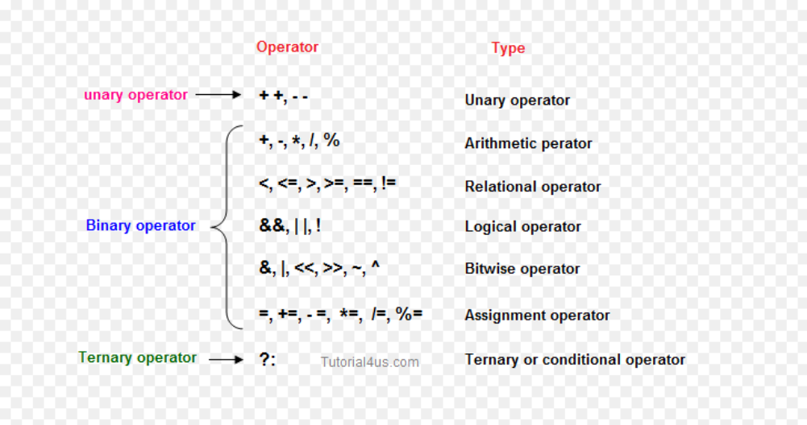
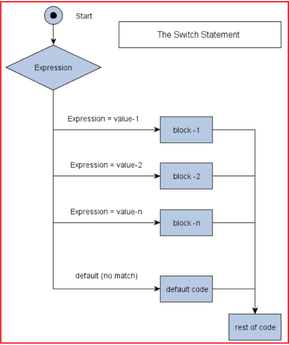
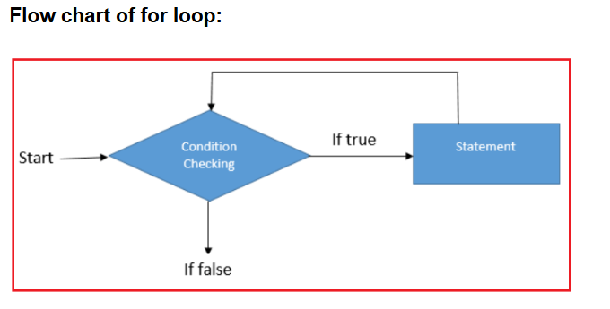
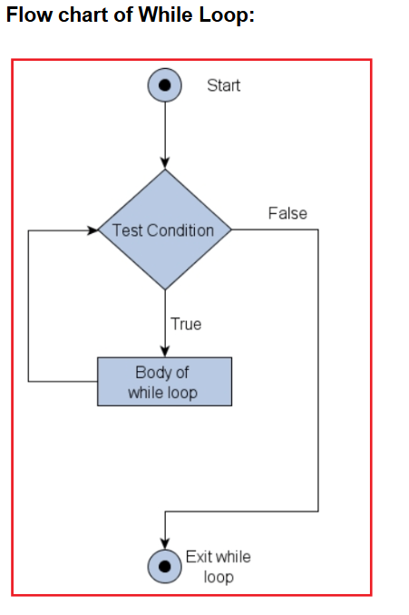
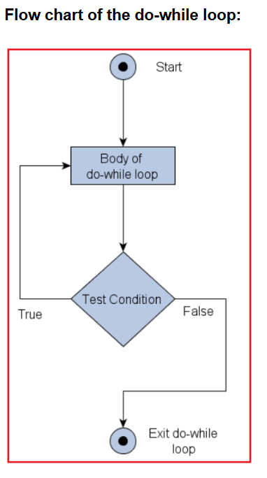

# Operators in Java
Java Operators
O
perators are used to perform operations on variables and values.

In the example below, we use the + operator to add together two values:
                                
                int x = 100 + 50;

## Java divides the operators into the following groups:
- Arithmetic operators
- Assignment operators
- Comparison operators
- Logical operators
- Bitwise operators

### Arithmetic operators :
Arithmetic operators are used to perform common mathematical operations.

### Assignment operators:
Assignment operators are used to assign values to variables.

### Comparison operators /Relational Operators :
Comparison operators are used to compare two values (or variables). This is important in programming, because it helps us to find answers and make decisions.

The return value of a comparison is either true or false. These values are known as Boolean values, and you will learn more about them in the Booleans and If..Else chapter.

###  Logical operators:
You can also test for true or false values with logical operators.

Logical operators are used to determine the logic between variables or values:

### Bitwise Operators
Operate on bits and perform bit-level operations:

- &: Bitwise AND.
- |: Bitwise OR.
- ^: Bitwise XOR.
- ~: Bitwise complement.
- <<, >>, >>>: Shift operators.

### Ternary Operator :

### Type comparison Opeator 
It used to do type check whether particular object is of certain class or not) 

#### InstanceOf 
(sometimes also shown under Relational Operators list)

## Operator Precedence :
Associativity : id 2 operators have same precedence,then its evaluated based on its Associativity(Left to Right or Right to Left)

# Control Flow Statements :
Generally, the statements inside your java code are executed from top to bottom, in the order that they appear. Control flow statements, change, or break the flow of execution by implementing decision making, looping, and branching your program to execute particular blocks of code based on the conditions. Statements can be executed multiple times or only under a specific condition. The if, else, and switch statements are used for testing conditions, the while and for statements to create cycles, and the break and continue statements to alter a loop.

## Types of Control Flow Statements in Java:
There are 3 types of control flow statements supported by the Java programming language:
- Decision-making statements: if-then, if-then-else, switch
- Looping statements: for, while and do-while
- Branching statements: break, continue, return

- 

### Decision-making Statements in Java:
Decision Making in programming is similar to decision making in real life. In programming also we face some situations where we want a certain block of code to be executed when some condition is fulfilled. Java decision-making statements allow you to make a decision, based upon the result of a condition. It happens when jumping of statements or repetition of certain calculations is not necessary.

#### Types of decision-making statements:
In Java, the decision-making statements are as follows:

1. if Statement
2. if-else statement
3. if-else if .. statement
4. Case statement

##### if statement in Java:
It is used to decide whether a certain statement or block of statements will be executed or not i.e if a certain condition is true then a block of statement is executed otherwise not.

Syntax:

            if (expression)
            {
            statement;
            }

Example :

                public class IfStatementDemo 
                {
                public static void main(String[] args)
                {
                boolean condition = true;

                if(condition) {
                    System.out.println("Condition is true");
                        } 
                    }
                }

##### if-else statement in Java:
We can use the else keyword to create a simple branch. If the expression inside the square brackets following the if keyword evaluates to false, the statement following the else keyword is automatically executed.

Syntax:
        
        if (expression)
        {
        statement-1;
        }
        else{
        statement-2;
        }

Example :

            public class IfElseStatementDemo 
            {
            public static void main(String[] args)
            {
            boolean condition = false;
    
            if(condition) {
                System.out.println("Condition is true");
            } 
            else
            {
            System.out.println("Condition is false");
                    }
                }
            }

##### if-else-if statement in Java:
We can create multiple branches using the else if keyword. The else if keyword tests for another condition if and only if the previous condition was not met. Note that we can use multiple else if keywords in our tests.

Syntax:
    
    if (expression)
    {
    statement-1;
    }
    else if{
    statement-2;
    }
    else {
    statement-3;
    }

Example:

        public class IfElseIfStatementDemo
        {
        public static void main(String[] args)
        {
        int i = 10;

        if(i > 10) 
          {
            System.out.println("Condition is greater than 10");
             } 
        else if(i < 10) 
             {
            System.out.println("Condition is less than 10");
              } 
        else
              {
            System.out.println("Condition is equal to 10");
             }
        }
        }

##### The switch statement in Java:
A switch statement gives you the option to test for a range of values for your variables. If you think your if-else-if statements are long and complex, you can use a switch statement instead.

Syntax:

        switch(expression)
        {
        case value1:
        Statement-1;
        break;
        
        case value2:
        Statement-2;
        break;
        
        Case valueN:
        Statement-N;
        break;
        }

Example:

    class SwitchCaseDemo
    {
    public static void main(String args[])
    {
    int age = 2;
    switch (age)
    {
    case 1:
    System.out.println("You are one year old.");
    break;
    case 2:
    System.out.println("You are two years old.");
    break;
    default:
    System.out.println("You are more than two years old.");
    }
    }
    }

## Looping Statements in Java

### What are Looping Statements in Java?
Looping in programming languages is a feature that facilitates the execution of a set of instructions/functions repeatedly while some condition evaluates to true.

### Types of looping statements in Java:
There are three types of looping statements in Java. They are as follows:

1. For loop 
2. While loop 
3. Do while loop

#### For Loop in Java:
The Java for loop repeats the execution of a set of Java statements. A for loop executes a block of code as long as some condition is true. The syntax to use for the loop is given below.

Syntex:
    
    for(initialization; condition; increment/decrement)
    {
    Statement(s);
    }

The initialization expression initializes the loop and is executed only once at the beginning when the loop begins. The termination condition is evaluated in every loop and if it evaluates to false, the loop is terminated. And lastly, increment/decrement expression is executed after each iteration through the loop.

Example :

    class ForLoopDemo
    {
    public static void main(String args[])
    {
    for(int num = 1; num <= 5; num++)
    {
    System.out.println(num);
    }
    }
    }

#### Enhanced for loop in Java:
Enhanced for loop provides a simpler way to iterate through the elements of a collection or array. It is inflexible and should be used only when there is a need to iterate through the elements in a sequential manner without knowing the index of the currently processed element.

Also, note that the object/variable is immutable when enhanced for loop is used, i.e it ensures that the values in the array cannot be modified, so it can be said as a read-only loop where you can’t update the values as opposed to other loops where values can be modified. The syntax to use the enhanced for loop in java is given below.
 
Syntex :
    
    for(T element : Collection object / array)
    {
    Statement(s);
    }

Example:
        
        public class EnhancedforloopDemo
        {
        public static void main(String args[])
        {
        String array[] = {"Ron", "Harry", "Hermoine"};

        //enhanced for loop 
        for (String x:array) 
        { 
            System.out.println(x); 
        } 
  
        /* for loop for same function 
        for (int i = 0; i < array.length; i++) 
        { 
            System.out.println(array[i]); 
        } 
        */
    } 
    }

#### While Loop in Java:
The while statement or loop continually executes a block of statements while a particular condition is true. The while statement continues testing the expression and executing its block until the expression evaluates to false. The syntax to use while loop in java is given below.

Syntex:
    
    while(condition)
    {
    Statement(s);
    }

Example :

        class whileLoopDemo
        {
        public static void main(String args[])
        {
        int x = 1;

        // Exit when x becomes greater than 4 
        while (x <= 4) 
        { 
            System.out.println("Value of x:" + x); 
  
            // Increment the value of x for 
            // next iteration 
            x++; 
        } 
    } 
    }

#### Do-while Loop in Java:
The difference between do-while and while is that do-while evaluates its expression at the bottom of the loop instead of the top. Therefore, the statements within the do block are always executed at least once.

Note that the do-while statement ends with a semicolon. The condition expression must be a boolean expression. The syntax to use the do-while loop is given below.

Syntex :

    do{
    Statement(s);
    }
    while(condition);

Example:

            class dowhileloopDemo
            {
            public static void main(String args[])
            {
            int x = 21;
            do
            {
            // The line will be printed even
            // if the condition is false
            System.out.println("Value of x:" + x);
            x++;
            }
            while (x < 20);
            }
            }

## Branching Statement :
Branching statements allow the flow of execution to jump to a different part of the program. The common branching statements used within other control structures include: break, continue, and return.

### Types of Branching Statement in Java:
In Java, there are three Branching Statements. They are as follows:

1. Break Statement
2. Continue Statement
3. Return Statement

#### Break statement in Java:
Using break, we can force immediate termination of a loop, bypassing the conditional expression and any remaining code in the body of the loop.

Note: Break, when used inside a set of nested loops, will only break out of the innermost loop.

Syntax: break label;

Example:

            class BreakStatementDemo
            {
            public static void main(String args[])
            {
            // Initially loop is set to run from 0-9
            for (int i = 0; i < 10; i++)
            {
            // terminate loop when i is 5.
            if (i == 5)
            break;
            System.out.println("i: " + i); 
            }  
            System.out.println("Loop complete."); 
            } 
            }

#### Continue Statement in Java:
The continue statement is used to skip a part of the loop and continue with the next iteration of the loop. It can be used in combination with for and while statements.

Example :

    class ContinueStatementDemo
    {
    public static void main(String args[])
    {
    for (int i = 0; i < 10; i++)
    {
    // If the number is even
    // skip and continue
    if (i%2 == 0)
    continue; 
    // If number is odd, print it  
    System.out.print(i + " "); 
    } 
    } 
    }

#### Return Statement in Java:
This is the most commonly used branching statement of all. The return statement exits the control flow from the current method and returns to where the method was invoked. The return statement can return a value or may not return a value. To return a value, just put the value after the return keyword.

But remember data type of the returned value must match the type of the method’s declared return value. And so when a method is declared void, use return without a return value.

Example :

        class ReturnStatementDemo
        {
        public static void main(String args[])
        {
        boolean t = true;
        System.out.println("Before the return.");

        if (t) 
            return; 
  
        // Compiler will bypass every statement  
        // after return 
        System.out.println("This won't execute."); 
    } 
    }

