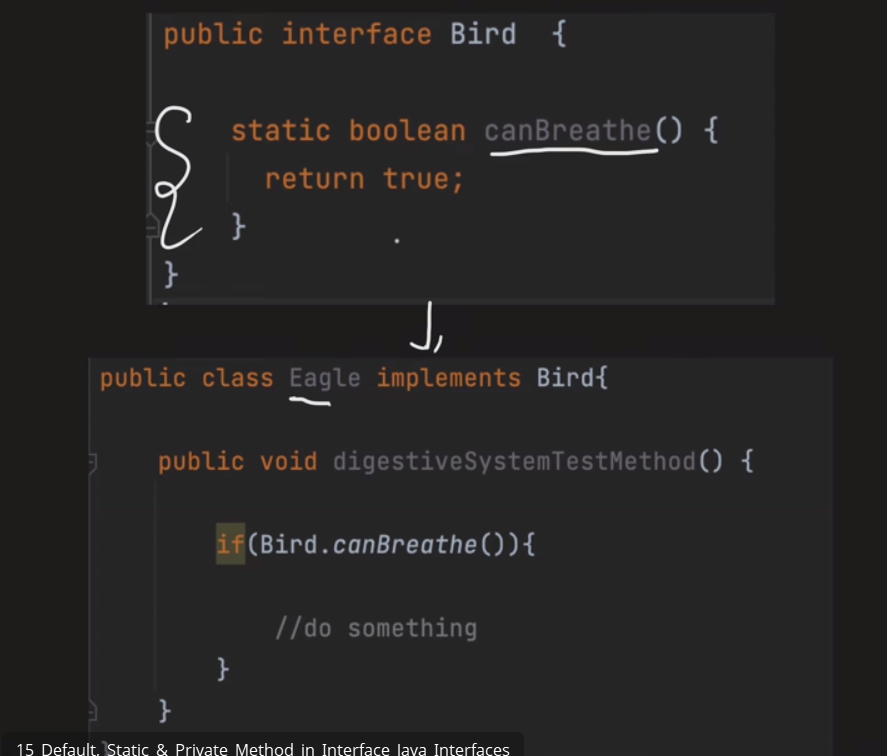
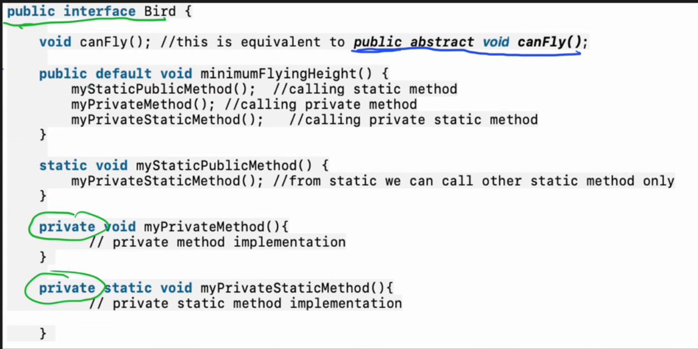

# Types Of Classes in Java

- Concreate Class 
- Abstract Class 
- Super Class and Sub Class
- Object Class
- Nested Class
  - Inner Class (Non Static Nested Class)
  - Anonymous Inner Class
  - Member Inner Class
  - Local Inner Class
  - Static Nested Class/Static Classes 
- Generic Class
- POJO Class
- Enum Class 
- Final Class
- Singletion Class 
- immutable Class
- Wrapper Class

## Concrete Class:
 - These are those class that we can create an instance using NEW keyword .
 - All the methods in this class have impementation.
 - It can also be your child class from interface or extend abstract class
 - A class access modifier can be "public" or "package private"(no explict modifier defined)

  

## Abstract Class:

Show only imporatant features to users and hide its internal implementation.

2 ways to achieve abstraction:

- Class is declared as abstracted through keyword "abstract".
- It can have both abstract(method without body) and non abstract methods.
- We can not create an instance of this class.
  - We parent has some features which all child classes have in common,then this can be used.
    - Constructors can be created inside them. And with super keyword from child classes we can access them.

           // Abstract class
          abstract class Sunstar {
          abstract void printInfo();
          }
        
          // Abstraction performed using extends
          class Employee extends Sunstar {
          void printInfo()
          {
          String name = "avinash";
          int age = 21;
          float salary = 222.2F;
        
                  System.out.println(name);
                  System.out.println(age);
                  System.out.println(salary);
              }
          }
        
          // Base class
          class Base {
          public static void main(String args[])
          {
          Sunstar s = new Employee();
          s.printInfo();
          }
          }

 
## Super and Sub Class :
- A class that is derived from another class is called a subclass.
- And from class through which Subclass is derived its called Superclass.
- In java,in the absence of any other explicit superclass,every class is implicitly a sub class of Object class.
- Object is the topmost class in java.
- Super class is also known as Parent class and sub class is known as Child class.

It has some common methods like clone(),toString(),equals(),notify(),wait() etc...

#### Example:
                    
                    // Parent class
        class Animal {
        void sound() {
        System.out.println("Animal makes a sound");
        }
        }
        
        // Child class
        class Dog extends Animal {
        void sound() {
        System.out.println("Dog barks");
        }
        }
        
        // Child class
        class Cat extends Animal {
        void sound() {
        System.out.println("Cat meows");
        }
        }
        
        // Child class
        class Cow extends Animal {
        void sound() {
        System.out.println("Cow moos");
        }
        }
        
        // Main class
        public class Geeks {
        public static void main(String[] args) {
        Animal a;
        a = new Dog();
        a.sound();

        a = new Cat();
        a.sound(); 

        a = new Cow();
        a.sound();  
      }
    }

## Nested Class :

Class within another class is called nested class.

When to use ?
If you know that,a class(A) will be used by only one another class(B),then instead of creates new file (A.java) for it,we can create nested classs inside B class itself.
And Also help us to group logically related classes in one file.

#### Scope :
Its Scope is same as og its Outer Class.

It is of 2 types 
- Staitc Nested Class
- Non static Nested Class.
  - Member Inner Class
  - Local Inner Class 
  - Anonymous Inner Class

### Static Nested Class :
- It do not have access to non static instance variable and method of outer class.
- Its object can be initiated without initiating the object of outer class.
- It can be private,public,protected or package-private(Default,no explicit declartion)

### Inner Class or Non Staic Nested Class:
- It have access to all the instance variable ane method of outer class.
- Its object can be initiated on after initiating the object of outer class.

#### Member Inner class
- Its can be private,publuc,protected,default 

#### Local Inner Class :
- These are those classes which are defined in any block like for loop,while loop block,if condition block,method etc.
- It can not be declared as private ,protected,public.Only defaukt (not defined explicit) access modifier is used.
- It can not be initiated outside of this block.

#### Anonymous Inner Class :
An inner class without a name called Anonymous class.

Why its used :
- When we want to override the behaviour of the method without even creating any subclass.

            public class Main {
      public static void main(String[] args) {
      // Here, we create an instance of a nameless class that extends Thread
      Thread myThread = new Thread() {
      // We override the run() method directly inside the definition
      @Override
      public void run() {
      System.out.println("This is running in a separate thread.");
      }
      }; // The semicolon marks the end of the statement

        myThread.start(); // Start the thread

        System.out.println("This is running in the main thread.");
      }
      }

## Inheritance in Nested Classes:

#### Example1: one inner class inherit another class in same outer class

        class Outer {
    // 1. Base inner class
    class Parent {
        void show() {
            System.out.println("Message from Parent inner class.");
        }
    }

    // 2. Child inner class extending the Parent inner class
    class Child extends Parent {
        @Override
        void show() {
            System.out.println("Message from Child inner class.");
        }
    }

    public static void main(String[] args) {
        // Create an instance of the outer class
        Outer outerInstance = new Outer();

        // Use the outer instance to create an instance of the child inner class
        Outer.Child childInstance = outerInstance.new Child();
        
        // Call the overridden method
        childInstance.show();
     }
    }

#### Example 2: Static inner Class inherited by different class

            // The enclosing class
        class Parent {
        // 1. A static nested class
        static class Greeting {
        void sayHello() {
        System.out.println("Hello!");
        }
        }
        }
        
        // 2. A regular class that extends the static nested class
        class PoliteGreeting extends Parent.Greeting {
        @Override
        void sayHello() {
        System.out.println("Hello! It's a pleasure to meet you.");
        }
        }
        
        // Main class to run the example
        public class Main {
        public static void main(String[] args) {
        // 3. Create an instance of the child class directly
        PoliteGreeting polite = new PoliteGreeting();

        polite.sayHello(); // Calls the overridden method
    }
    }

#### Example 3: Non static Inner Class inherited by differet class 

    // 1. The base class with its own inner class
    class Vehicle {
    private String type;

    public Vehicle(String type) {
        this.type = type;
        System.out.println("Vehicle created: " + type);
    }

    // A non-static inner class
    class Engine {
        public void start() {
            // It can access the outer class's members
            System.out.println("The " + type + "'s engine starts.");
        }
    }
    }
    
    // 2. The derived class
    class Car extends Vehicle {
    public Car(String model) {
    super(model); // Calls the Vehicle constructor
    }

    // 3. An inner class inside the derived class
    //    that inherits from the base class's inner class
    class V8Engine extends Engine {
        
        // Overriding the parent inner class's method
        @Override
        public void start() {
            System.out.println("The V8 engine roars to life!");
        }
    }
        }
        
        // 4. Main class to demonstrate
        public class Main {
        public static void main(String[] args) {
        // First, create an instance of the subclass
        Car myCar = new Car("Sports Car");
        
        // Now, create an instance of the Car's inner class
        // This syntax is essential: outerInstance.new InnerClass()
        Car.V8Engine myEngine = myCar.new V8Engine();

        // Call the overridden method
        myEngine.start();
    }
    }

### Generic class:
In Java, Generics provide type-safe, reusable code by allowing parameterized types. They enable classes, interfaces and methods to work with any data type (e.g., Integer, String or custom types) while ensuring compile-time type checking and reducing runtime errors. Using type parameters like <T>, generics promote cleaner, more flexible and stable code.

1. Generic Class with Single Type Parameter
   A generic class can be reused with any data type by replacing T with specific types like Integer, String or custom classes. It is declared like a regular class but includes a type parameter (e.g., <T>) after the class name.

    class Solution<T> {
    T data;

    // Generic method inside a generic class (corrected)
    public T getData() {
        return data;
    }
    }
2. Generic Class with Multiple Type Parameters
   You can define multiple type parameters in a generic class using commas (e.g., <K, V>).

    public class Pair<K, V> {

    private K key;
    private V value;

    public Pair(K key, V value) {
    this.key = key;
    this.value = value;
    }

    public K getKey()    { return key; }
    public V getValue() { return value; }
    }

#### Key Points About Generic Classes

- A generic class can be reused with any data type.
- Declared with a type parameter (e.g., <T>) after the class name.
- Multiple type parameters can be used (e.g., <T, U>).
- Type parameters must be reference types (not primitives like int, float, etc.).

#### Generic Methods in Java
A generic method is a method that declares its own type parameters. It can be called with arguments of different types and the compiler infers the correct type during the method call.

#### Rules for Generic Methods
- Declare type parameters in angle brackets < > before the return type.
- Multiple type parameters can be separated by commas.
- Type parameters can only be reference types (not primitives).
- They can be used in return types and method parameters.
- Method body is defined like a regular method.

### Wildcards in Java

In Java Generics, wildcards are used when you don’t know the exact type. They let you write flexible and reusable code. The wildcard is represented by a ? (question mark). Wildcards are mainly used in method parameters to accept different generic types safely.

#### Types of wildcards in Java

1. Upper Bounded Wildcards
- These wildcards can be used when you want to relax the restrictions on a variable. For example, say you want to write a method that works on List < Integer >, List < Double > and List < Number >, you can do this using an upper bounded wildcard.

- To declare an upper-bounded wildcard, use the wildcard character ('?'), followed by the extends keyword, followed by its upper bound. 

        public static void add(List<? extends Number> list)

#### Implementation:
    import java.util.Arrays;
    import java.util.List;
    
    class WildcardDemo {
    public static void main(String[] args)
    {
    // Upper Bounded Integer List
    List<Integer> list1 = Arrays.asList(4, 5, 6, 7);

        System.out.println("Total sum is:" + sum(list1));

        // Double list
        List<Double> list2 = Arrays.asList(4.1, 5.1, 6.1);

        System.out.print("Total sum is:" + sum(list2));
    }

    private static double sum(List<? extends Number> list)
    {
        double sum = 0.0;
        for (Number i : list) {
            sum += i.doubleValue();
        }

        return sum;
    }
    }

*Explanation:* In the above program, list1 holds Integer values and list2 holds Double values. Both are passed to the sum method, which uses a wildcard <? extends Number>. This means it can accept any list of a type that is a subclass of Number, like Integer or Double.

2. Lower Bounded Wildcards
   It is expressed using the wildcard character ('?'), followed by the super keyword, followed by its lower bound: <? super A>.

        Syntax: Collectiontype <? super A>

#### Implementation: 

                import java.util.Arrays;
        import java.util.List;
        
        class WildcardDemo {
        public static void main(String[] args)
        {
        // Lower Bounded Integer List
        List<Integer> list1 = Arrays.asList(4, 5, 6, 7);

        // Integer list object is being passed
        printOnlyIntegerClassorSuperClass(list1);

        // Number list
        List<Number> list2 = Arrays.asList(4, 5, 6, 7);

        // Integer list object is being passed
        printOnlyIntegerClassorSuperClass(list2);
    }

    public static void printOnlyIntegerClassorSuperClass(
        List<? super Integer> list)
    {
        System.out.println(list);
    }
    }

*Explanation:* Here, the method printOnlyIntegerClassorSuperClass accepts only Integer or its superclasses (like Number). If you try to pass a list of Double, it gives a compile-time error because Double is not a superclass of Integer.

3. Unbounded Wildcard
This wildcard type is specified using the wildcard character (?), for example, List. This is called a list of unknown types. These are useful in the following cases -
- When writing a method that can be employed using functionality provided in Object class.
- When the code is using methods in the generic class that doesn't depend on the type parameter

#### Implementation:
            import java.util.Arrays;
        import java.util.List;
        
        class unboundedwildcardemo {
        public static void main(String[] args)
        {

        // Integer List
        List<Integer> list1 = Arrays.asList(1, 2, 3);

        // Double list
        List<Double> list2 = Arrays.asList(1.1, 2.2, 3.3);

        printlist(list1);

            printlist(list2);
        }
    
        private static void printlist(List<?> list)
        {
    
            System.out.println(list);
        }
    }

### Type Erasure in Java
In Java, Generic provides tighter type checks at compile time and also enable generic programming. The way to implement generics, the Java compiler applies type erasure to:

- Replace all type parameters in generic types with their bounds or Object if the type parameters are unbounded. The produced bytecode, therefore, contains only ordinary classes, interfaces, and methods.
- Insert type casts if necessary to preserve type safety.
  - Generate bridge methods to preserve polymorphism in extended generic types.

        Note: Type Erasure is the process that removes generic type information at runtime and replaces it with the upper bound.

### How Type Erasure Works in Java?
Now, we are going to discuss how Type Erasure works in Java

            // A generic class to hold an item of any type T
                class Box<T> {
                private T item;
                
                    public void put(T item) {
                        this.item = item;
                    }
                
                    public T get() {
                        return this.item;
                    }
                        }
        
                    public class Main {
                    public static void main(String[] args) {
                    // We create a Box specifically for String objects.
                    Box<String> stringBox = new Box<>();
            
                    // The compiler checks this. It's a valid String.
                    stringBox.put("Hello, World!");
            
                    // The compiler would throw an error here because 123 is not a String.
                    // stringBox.put(123); // This line is commented out but shows type safety.
            
                    // We get the item back. No need for a manual cast.
                    String message = stringBox.get();
            
                    System.out.println(message);
                }
            }

## POJO Class:
- Stands for "Plain Old Java Object".
- Contains variable amd its getter and setter methods.
- Class shuld be public.
- Public defalut constructor.
- Noannotaions should be used like @Table, @Entity,@ID etc..
- It should not extends any class or implement any interface.

#### Example :
        
            public class Product {
            // 1. Private fields to hold the object's data
            private String sku;
            private String name;
            private double price;
        
            // 2. A public, no-argument constructor (optional but recommended)
            public Product() {
            }
        
            // 3. Public "getter" and "setter" methods for each field
            public String getSku() {
                return sku;
            }
        
            public void setSku(String sku) {
                this.sku = sku;
            }
        
            public String getName() {
                return name;
            }
        
            public void setName(String name) {
                this.name = name;
            }
        
            public double getPrice() {
                return price;
            }
        
            public void setPrice(double price) {
                this.price = price;
            }
        }

## Enum Class :
- It has a collection CONSTANTS(variables which values can not be changed)
- Its CONSTANTS are static and final implicity(we do not have to write it).
- It can not extends any class,as it internally extends java.lang.Enum class
- It can implement interfaces.
- It can have variables,construtor,methods.
- IT can not be initiated(as its constructor will be private only,even you give default,in bytecode it make it private)
- No other class can extend Enum class
- It can have abstract method,and all the constant should implement that abstract method.

            public enum DayOfWeek {
        
            // 1. Define the enum constants with their custom values
            MONDAY(1, false),
            TUESDAY(2, false),
            WEDNESDAY(3, false),
            THURSDAY(4, false),
            FRIDAY(5, false),
            SATURDAY(6, true),
            SUNDAY(7, true);
        
            // 2. Private final fields to hold the custom data
            private final int dayNumber;
            private final boolean isWeekend;
        
            // 3. Private constructor to initialize the fields
            private DayOfWeek(int dayNumber, boolean isWeekend) {
                this.dayNumber = dayNumber;
                this.isWeekend = isWeekend;
            }
        
            // 4. Public getter methods to access the custom data
            public int getDayNumber() {
                return dayNumber;
            }
        
            public boolean isWeekend() {
                return isWeekend;
            }
        }

## Sinleton Class :
This class objectie is to create only 1 and 1 Object.

Different Ways of creating Singleton Class :

- Eager Initialization
- Lazy Initialzation
- Synchornization Block 
- Double Check Lock (there is a memory issue,resolved through Volatile instance variable)
- Bill Pugh Solution
- Enum Singleton

Eager Initizaton :

Lazy Initialzation

Synchornization Block

Double Locking :

Bill Pugh Solution:!

(.idea/Images/img10.png)

Enum Singleton :

## Immutable Class :

- We can not change the value of an object it is created.
- Declare class as 'final' so that it can not be extended.
- All class members should be private. So that direct access can be archived.
- And class members are initialized only once using constructor.
- There should not be any setter methods,which is generally use to change the valure.
- Just getter methods. And returns Copy of the member variable.
- Example : String,Wrapper Classes etc.

 

# Interface :

## What is interface and How to Define 

Interface is something which helps 2 System to interact with each other,without one system has to know the details of other.

Or in simple term Ican say,it helps to archive ABSTRACTION.

## How to Define Interface
Interface declaration consist of 
- Modifiers
- "interface" keyword
- Interface Name 
- Comma separated list of parent interfaces
- Body

Only Public and Default Modifiers are allowed (Protected and private are not allowed)

Comma separated list of parent interfaces (it can extend from Class)
#### Example:

- Why we need interface
1. Abstraction:
 Using interface,we can achieve full Abstraction means,we can define WHAT class must do,but not HOW it will do

2. Polimorphism :

- Interface can be used as a Data Type.
- We can not create the object of an interface,but it can hold the reference of all the classes which impliments it.And at runtime,it decide which method need to be invoked.

Dimond Problem :

## Methods in Interface 
  - All methods are imolicit public only.
  - Method can not be declared as final.

## Interface Implimementation 
- Overriding method can not have more restrict access specifiers.
- Concrete classmust override all the methods declared in the interface.
- Abstract classes are not forced to override all the methods.
- A class can implement from multiple interfacs.

- Fields in an Interface
  - Fields are public,static and final implicitly(CONSTANTS)
  - You can not make field private or protected.

### Nested Interface
- Nested Interface declared within another Interface.
- Nested interface declared within a Class.

Generally its is used to group,logical related.And Nested interface 

Rules :
- A nested interface declared within an interface must be public
- A nested interface declared within a class can have any access modifier.
- When you implement outer interface,inner interface imolementation is not required and vice versa.

## Difference Between Interface and Abstract class.

3. Multiple Inheritance :
 In java Multiple inheritance is possible only through  Interface Only.

## Java8 Interface Feactures :

### Default method 
- Before Java8,interface can have only Abstract method.And all child classes has to provide abstract method implementation. 

Any new mwthod added in interface, means need to change in all its implementation.

#### Why Default method was interoduced :
- To add functionality in existing Legacy Interface we need to use Default method.Example steam() method in Collection

#### Default and Multiple Inheritance.how to handle:

 

#### How to extends Interface that contains Default Method

    // Main.java
    
    // 1. The interface with a default method
    interface Loggable {
    
    /**
     * An abstract method that implementing classes must provide.
     * It should return a unique identifier for the class.
     */
    String getIdentifier();

    /**
     * A default method that provides a ready-to-use logging implementation.
     * Any class that implements Loggable can use this method without
     * needing to write its own version.
     *
     * @param message The message to be logged.
     */
    default void log(String message) {
        // The default behavior is to print the message to the console,
        // prefixed with the class's identifier.
        System.out.println("LOG [" + getIdentifier() + "]: " + message);
    }
    }

    // 2. A class that implements the interface
    class UserService implements Loggable {

    // This class MUST provide an implementation for the abstract method.
    @Override
    public String getIdentifier() {
        return "USER_SERVICE";
    }

    // This class does NOT need to provide an implementation for log().
    // It inherits the default version from the Loggable interface.

    public void createUser(String username) {
        // Here, we call the inherited default log() method.
        log("Attempting to create user: " + username);
        
        // ... business logic to create the user would go here ...
        
        log("User '" + username + "' created successfully.");
    }
    }

        
        // 3. The main class to run the example
        public class Main {
        public static void main(String[] args) {
        // Create an instance of the class that implements the interface.
        UserService userService = new UserService();

        // Call the method that uses the default logging functionality.
        userService.createUser("alice_123");
    }
    }

## Static Method (Java8):
- We can provide the implementation of the method in interface.
- But it can not be overridden by classes which implement the interface.
- We can access it using Interface name itself.
- Its by Default public

- Functional interface

 ## Java9 Interface feature :
### Private method :
- we can provide the implementatiom of method but as a private access mofifier in interface.
- It bringd more readabillty of the code. For example if multiple deafault method share some code,that this can help
- It can be defined as static and non-static.
- From static method,we can call only private static interface method.
- Private static method,can be called from both static and non static method.
- Private interface method can not be abstract Meanser have to provide the definition.
- It can be used inside of the particular interface only .

