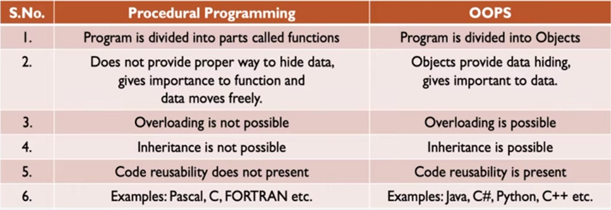
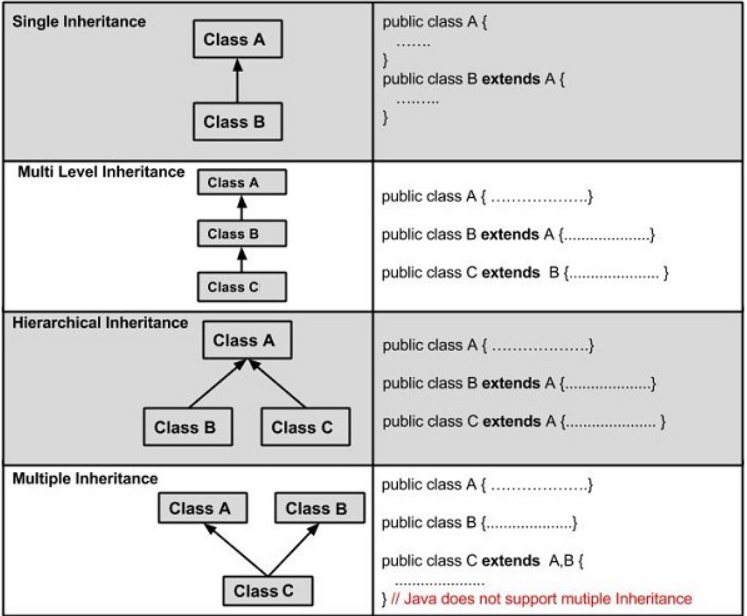
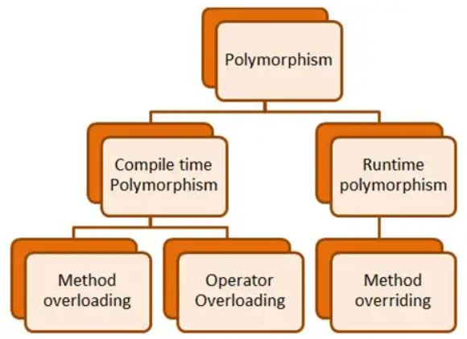
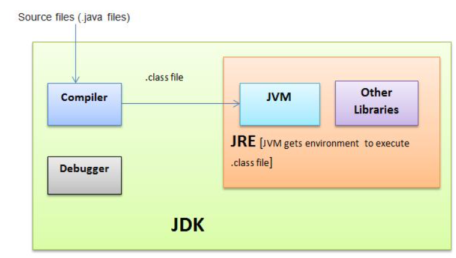
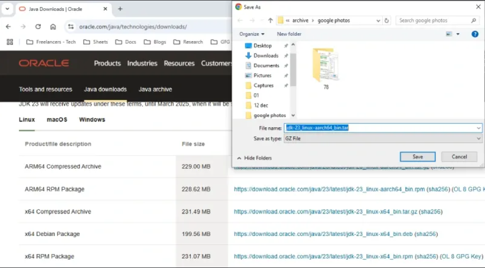
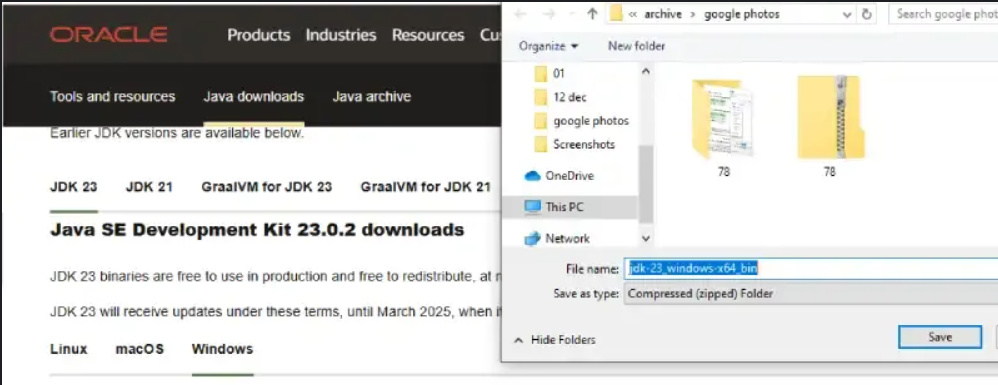
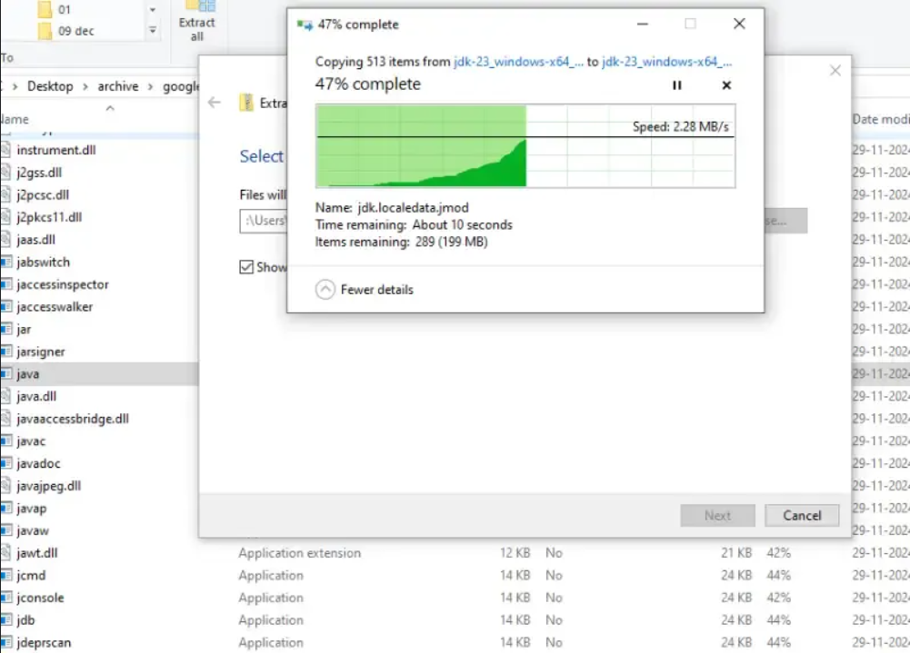
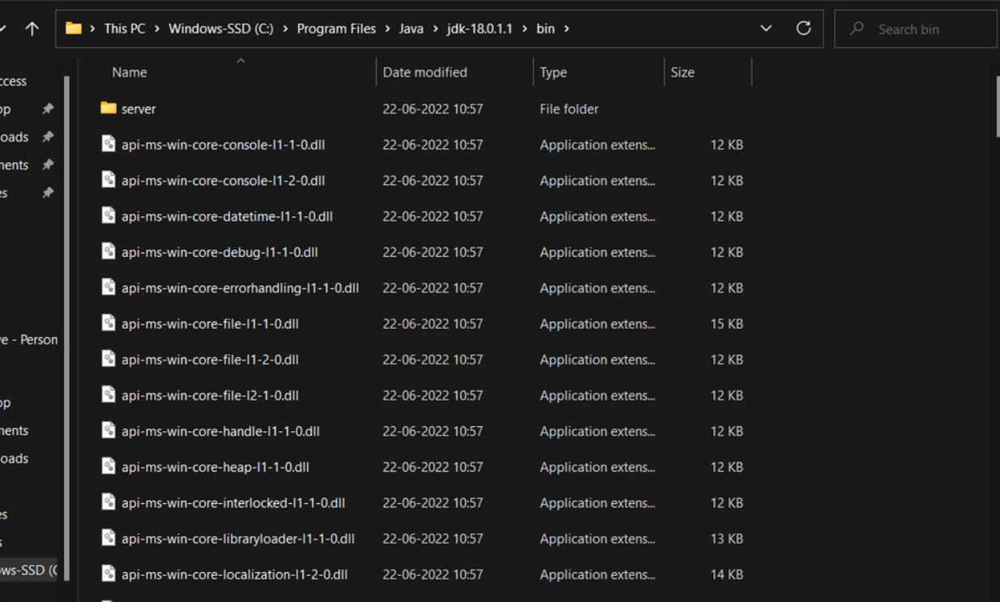

# OOPs FUNDAMENTALS IN JAVA

Welcome to the **OOP (Object-Oriented Programming)** basics project!  
This repository explains OOP concepts with code examples in a **simple & symbol-based style**.

## OOPs OVERVIEW
- OOPS means Object-Oriented Programming
- Here Object means real word entity like Car,Bike,ATM etc.
- Procedural Progamming VS OOPS

## Object And Classes
**Object has 2 things:**
- Properties or State
- Behaviour or Function
- we can create object by **new** keyword
### Example:
**Dogs is an Object because it has:**
- Properties like: Age,Breed,Color etc.
- Behaviours like:Bark,Sleep,Eat etc.

**Car is an Object because it has:**
- Properties like:Color,Type,Brand,Weight etc.
- Behaviours like: Apply Break,Drive,Increase Speed etc.

### Classes:
**Class is Used For Creating Object**
- To Create Object,a Class is requred.
- So, Class provides the template or Blueprint from which Object can created.
- From one class, we can create multiple Objects.
- To create a class use the keyword :**class**
- class name first letter is always capital.

#### Syntex:
               class Demo {
                //Properties --All the data variables are known as Properties    
                //Behaviour -- This is Known as data Method
                }

#### Example
               class Student {
                //Properties
                String name;
                int Salary;
                //Behaviour
                void updateAddress();
               }

## Pillar of  OOPs
1.Data Abstraction 

2.Encapsulation

3.Inheritance
- Types of inheritance:Single Multiple etc.

4.Polymorphism
- Static Polymorphism
- Dynamic Polymorphism

### 1.DATA ABSTRACTION 
- It hides the internal implementation and shows only essential functionality to the user
- It can be achieved through Interface and abstract classes
#### Example:
- **Car** - we only show the **BREAK** pedal and if we pressit,Car speed reduce.But HOW? That is ABSTRACTED to us.
- **Cellphone** - how call is made that is Abstracted to us.
#### Advantages of Abstraction :
  - Increase sercurity and confiedntiality

##### Example:
                // Interface
        interface Vehicle {
          void start(); // Abstract method
          void stop(); // Abstract method
        }

        // Class implementing the interface
        class Car implements Vehicle {
          @Override
          public void start() {
            System.out.println("Car is starting...");
          }

          @Override
          public void stop() {
            System.out.println("Car is stopping...");
          }
        }

        public class Main {
          public static void main(String[] args) {
            Vehicle myCar = new Car(); // Interface reference
            myCar.start(); // Calls the Car's implementation
            myCar.stop(); // Calls the Car's implementation
          }
        }

### DATA ENCAPSULATION
- Encapsulation bundles the data and the code working on that data in a single unit.

- Also know as **DATA-HIDING**.
- Steps to achieve encapsulation. 
  - Declare variable of a Class as private.
  - Provide a public Getters and Setters to modify and view the value of the variables.

- **Advantages of encapsulation**
- Loosely  coupled code 
- Better access control and security

##### Example:
        // Class with encapsulation
    public class Student {
    // Private variables (data hiding)
    private String name;
    private int age;

     // Getter method for 'name'
     public String getName() {
       return name;
     }

     // Setter method for 'name'
     public void setName(String name) {
       this.name = name;
     }

     // Getter method for 'age'
     public int getAge() {
       return age;
     }

     // Setter method for 'age'
     public void setAge(int age) {
       if (age > 0) { // Validation for secure data manipulation
         this.age = age;
       } else {
         System.out.println("Age must be positive!");
       }
     }
    }

        // Main class to test encapsulation
        public class Main {
        public static void main(String[] args) {
        Student student = new Student();

       // Setting values using setter methods
       student.setName("Rahul");
       student.setAge(20);

       // Accessing values using getter methods
       System.out.println("Name: " + student.getName());
       System.out.println("Age: " + student.getAge());
     }
    }

### INHERITANCE
- Capability of a vlass inherit properties from their parent Class.
- It can inherit both function and variabkes,so we do not have to write them again in child classes.
- Can be archived using extends keywird or through interface.
- Types of inheritance
  - Single
  - Multilevel
  - Hiearchical
  - Multiple Inheritance -through interface can reslove the diamond problem

#### Advantages Of inheritance 
- Code reusability
- we can achieve Polymorphism using inheritance
##### Syntex:
       class Parent {
        // Parent class fields and methods
        }
        
        class Child extends Parent {
        // Child class fields and methods
        }

##### Example:
            // Parent class
            class Animal {
              void eat() {
                    System.out.println("This animal eats food.");
              }
            }
            
            // Child class
            class Dog extends Animal {
              void bark() {
                 System.out.println("The dog barks.");
              }
            }
            
            public class Main {
             public static void main(String[] args) {
                Dog dog = new Dog();
                dog.eat(); // Inherited method
                dog.bark(); // Child class method
               }
            }

### POLYMORPHISM
- Poly means **Many** and Morphism means **Form**
- A same method,behaves differently in different situation
  - Example:
    - A person can be father,husband,employee etc.
    - Water can be liquid,solid and gas etc.

- Types of Polymorphism
      - Compile Time/Static Polymorphism /Method Overloading
      - Run Time / Dynamic Polymorphism / Method Overriding 

**Compile Time/Static Polymorphism /Method Overloading : In A Class Method name is same but with different Parameters**
##### Example:
                      class Calculator {
                        // Method with one parameter
                        int add(int a) {
                        return a + 10;
                        }
        
                    // Method with two parameters
                      int add(int a, int b) {
                        return a + b;
                       }
                
                    // Method with different parameter types
                    double add(double a, double b) {
                         return a + b;
                          }
                    }
        
                public class Main {
                public static void main(String[] args) {
                Calculator calc = new Calculator();
                System.out.println(calc.add(5));          // Calls method with one int parameter
                System.out.println(calc.add(5, 10));     // Calls method with two int parameters
                System.out.println(calc.add(5.5, 4.5));  // Calls method with two double parameters
                  }
               }

**Run Time / Dynamic Polymorphism / Method Overriding : Different Class with same method and same parameters**
##### Example:
        class Animal {
        public void move() {
           System.out.println("Animals can move");
           }
        }
        class Dog extends Animal {
           public void move() {
           System.out.println("Dogs can walk and run");
           }
        }
        public class TestDog {
        public static void main(String args[]) {
           Animal a = new Animal(); // Animal reference and object
           Animal b = new Dog(); // Animal reference but Dog object
           a.move(); // runs the method in Animal class
           b.move(); // runs the method in Dog class
            }
        }

## Object Relationship
- Is-a Relationship
  - Achieved through Inheritance 
  - Example: Dog is-a Animal
  - Inheritance form an is-a relationship between its parent child classes.
  

- Has-a Relationship
   - Whenevver,an Object is used in Other Class,it's Called Has-A relationship
   - Relationship could be one-one,one-many, many to many.
   - Example:
     -School has Students 
     - Bike has Engine 
     - School has Classes 
   - Associatation realationship between 2 different Objects.
     - Aggregation : Both Objects Can survive indidually,means ending of one object will not end other object.
     - Composition :Ending of one object will end another object .

# Java Basics Overview (JDK,JRE,JVM)

**What is java?**
- Java is a**Plateform Independent Language**.
- Java is  Highly popular OOPs Programming Language
- Portability [WORA=Write Once,Run Anywhere]

> Java is a Platform depend but the Java code After compilation the .file is Platfrom independ

### Three main components of java 
1. JVM (Java Virtual Machine)
2. JRE (Java Runtime Environment ) 
3. JDK (Java Development Kit)

**JVM (Java Virtual Machine)** 
- JVM is the abbreviation for Java Virtual Machine which is a specification that provides a runtime environment in which Java byte code can be executed i.e. 
it is something that is abstract and its implementation is independent of choosing the algorithm and has been provided by Sun and other companies. 
- It is JVM which is responsible for converting Byte code to machine-specific code.
- It can also run those programs which are written in other languages and compiled to Java bytecode. 
- The JVM performs the mentioned tasks: Loads code, Verifies code, Executes code, and Provides runtime environment.

**JRE (Java Runtime Environment)**
- JRE is a Java Runtime Environment which is the implementation of JVM i.e. the specifications that are defined in JVM are implemented and create a corresponding environment for the execution of code.
- JRE comprises mainly Java binaries and other classes to execute the program like JVM which physically exists.
- Along with Java binaries JRE also consists of various technologies of deployment, user interfaces to interact with code executed, some base libraries for different functionalities, and language and util-based libraries.

**JDK (Java Development Kit)**
- JDK stands for Java Development Kit which includes all the tools, executables, and binaries required to compile, debug, and execute a Java Program.
- JDK is platform dependent i.e. there are separate installers for Windows, Mac, and Unix systems.
- JDK includes both JVM and JRE and is entirely responsible for code execution. 
- It is the version of JDK that represents a version of Java.

**Difference Between JVM,JRE,JDK**

 

## How to download the JDK
- Step 1: Visit the Official Website 
  -Go to the https://www.oracle.com/java/technologies/downloads/  to download the file

- Step 2: Select the Appropriate Version
  - As of 2025, the latest stable versions are JDK 23 (SE) and JDK 21 (LTS). Select the compatible version as per your operating system (Windows, Mac or Linux)

  
- 
- Step 3: License and Agreement
  - Go through all the License and Agreement before downloading (from Oracle website), it will not ask if you'll download it from OpenJDK website.
  ### Install JDK on Windows
Follow the below steps to install JDK on Windows environment i.e.Windows 7, Windows 8, Windows 8.1, Windows 10, and Windows 11.

#### Step 1: Run the Java Development Kit (JDK) Installer
Locate the downloaded .exe file (e.g. jdk-23-windows-x64_bin.exe) and make the double click to begin the Installation process. Follow the installation wizard prompts to complete the installation process.

#### Step 2: Setup the Environment Variables
Once the installation gets completed, you need to configure environment variables to notify the system about the directory in which the JDK files are located.

Proceed to C:\Program Files\Java\jdk-{YOUR_JDK_VERSION}\bin (replace {-} with your JDK version)

##### Step 2.1: To set the Environment Variables, you need to search Environment Variables in the Task Bar and click on “Edit the system environment variables”.

##### Step 2.2: Under the Advanced section, Click on "Environment Variables".

##### Step 2.3: Under System variables, select the "Path" variable and click on "Edit". Click on "New" then paste the Path Address i.e. C:\Program Files\Java\jdk-{YOUR_JDK_VERSION}\bin. Click on "OK".

##### Step 2.4: Now, in the Environment Variables dialogue, under System variables, click on "New" and then under Variable name: JAVA_HOME and Variable value: paste address i.e.

C:\Program Files\Java\jdk-{YOUR_JDK_VERSION}. Click on OK => OK => OK.

#### Step 3: Check the Java Version
Open Command Prompt and enter the following commands:
- java -version
- javac -version

### JSE(Java Standard Edition)
- JSE, also known as Core Java, this is the most basic and standard version of Java. It’s the purest form of Java, a basic foundation for all other editions. It consists of a wide variety of general purpose API’s (like java.lang, java.util) as well as many special purpose APIs.

- JSE is mainly used to create applications for Desktop environment. It consist all the basics of Java the language, variables, primitive data types, Arrays, Streams, Strings Java Database Connectivity (JDBC) and much more. This is the standard, from which all other editions came out, according to the needs of the time.
### JEE(Java Enterprise Edition)
- The Enterprise version of Java has a much larger usage of Java, like development of web services, networking, server side scripting and other various web based applications. J2EE is a community driven edition, i.e. there is a lot of continuous contributions from industry experts, Java developers and other open source organizations.
### JME(Java Micro Edition)
- This version of Java is mainly concentrated for the applications running on embedded systems, mobiles and small devices.(which was a constraint before it’s development). Constraints included limited processing power, battery limitation, small display etc.

## First Java Program 
        // This is a simple Java program
        public class HelloWorld {
        public static void main(String[] args) {
        // Prints "Hello, World!" to the console
        System.out.println("Hello, World!");
             }
        }

> JVM Calls the Main() So,here main is a starting Point 

### What do you mean by  public static void main(String[] args) { }
- Here,**public** is a access modifier,we can call public from anywhere
- Here,**static** is a keyword,we can call the class without creating object
- Here,**void** is a no return type
- Here ,**main** is a method name it is always main because jvm only know main
- Here,**(String[] args)** is a parameter of main method
          
## Interview Questions
 ### Why in java a single file can have only 1 Public Class?
- In Java, a single file can have only one public class due to design principles and practical reasons that ensure clarity, maintainability, and proper compilation. Here's why:
1. File Naming Convention

   - The name of the file must match the name of the public class it contains. For example, if the public class is MyClass, the file must be named MyClass.java. This convention ensures that the Java compiler and developers can easily locate the class.

2. Compilation and Accessibility

    - Public classes are accessible from anywhere in the application. Allowing multiple public classes in a single file could create confusion during compilation and runtime, as the compiler would struggle to determine which class to associate with the file name.

3. Code Organization and Readability

     - Restricting a file to one public class promotes better organization and readability. It encourages developers to separate concerns and keep each class focused on a single responsibility, making the codebase easier to understand and maintain.

4. Avoiding Ambiguity

     - If multiple public classes were allowed in a single file, it could lead to ambiguity when importing classes from other packages. This restriction ensures that each public class has a unique identity tied to its file.

5. Java's Design Philosophy

    - Java was designed with simplicity and predictability in mind. This restriction aligns with its philosophy of reducing complexity and potential errors in large-scale applications. 
    - While a single file can have multiple non-public (default) classes, only one public class is allowed to maintain these principles. This design choice has proven effective in managing Java projects of all sizes.

# Variables in Java :
## What is variable?
- Variable is a Idenitfier.
- It is the name of the memory location of data and values.
- Variable is a container which store the values. 
   - Datatype VariableName = Value;
   - Example:
     - int var =30;
     - char ch ='a';
## Variable Naming Convention:
1. Variable name is  Case-sensitive.
2. Variable name can be any legal identifier means can contain Unicode letters.
3. Variable name can start is $,_ and letter.
4. Variable name can not be JAVA reserved Keyword like"new","class","while" etc.
5. Variables should be all small if it contains only 1 word else camel case should be followed.
6. For Constant,Variable name should be define in CAPITAL LETTERS

## Kind of Vaariable:
- Local
- Instance
- Static/class Variable
- Method Parameters
- Constructor Parameters

### Local Variable
A variable defined within a block or method or constructor is called a local variable.

- The Local variable is created at the time of declaration and destroyed when the function completed its execution.
- The scope of local variables exists only within the block in which they are declared.
- We first need to initialize a local variable before using it within its scope.

#### Example:
This example show how a local variable is declared and used inside the main method and it can not be used outside of it.
            
        import java.io.*;
        class Local_variable {
        public static void main(String[] args)
        {
        // Declared a Local Variable
        int var = 10;

        // This variable is local to this main method only
        System.out.println("Local Variable: " + var);
        }
    }

### Instance Variable
Instance variables are known as non-static variables and are declared in a class outside of any method, constructor, or block.
- Instance variables are created when an object of the class is created and destroyed when the object is destroyed.
- Unlike local variables, we may use access specifiers for instance variables. If we do not specify any access specifier, then the default access specifier will be used.
-Initialization of an instance variable is not mandatory. Its default value is dependent on the data type of variable. For String it is null, for float it is 0.0f, for int it is 0, for Wrapper classes like Integer it is null, etc.
- Scope of instance variables are throughout the class except the static contexts.
- Instance variables can be accessed only by creating objects.
- We initialize instance variables using constructors while creating an object. We can also use instance blocks to initialize the instance variables.

#### Example:
This example demonstrates the use of instance variables, which are declared within a class and initialized via a constructor, with default values for uninitialized primitive types.

    import java.io.*;
    class Instance_variable {

    // Declared Instance Variable
    public String geek;
    public int i;
    public Integer I;
    public Geeks()
    {
        // Default Constructor
        // initializing Instance Variable
        this.geek = "Sweta Dash";
    }

    // Main Method
    public static void main(String[] args)
    {
        // Object Creation
        Geeks name = new Geeks();

        // Displaying O/P
        System.out.println("Geek name is: " + name.geek);
        System.out.println("Default value for int is "+ name.i);
      
        // toString() called internally
        System.out.println("Default value for Integer is: "+ name.I);
        }
    }

### Static Variable

## Types Of Conversion:
- Widening/Automatic Conversion
- Narrowing /Downcating/Explict Conversion
- Promotion during expresstion
- Explicat casting during Expresstion

### Widening/Automatic Conversion
Widening conversion takes place when two data types are automatically converted. This happens when:
- The two data types are compatible.
  - When we assign a value of a smaller data type to a bigger data type.

    - Example:

           // Main class
           class TypeConversion {
    
             // Main driver method
             public static void main(String[] args)
             {
                 int i = 100;
    
             // Automatic type conversion
             // Integer to long type
             long l = i;
    
             // Automatic type conversion
             // long to float type
             float f = l;
    
             // Print and display commands
             System.out.println("Int value " + i);
             System.out.println("Long value " + l);
             System.out.println("Float value " + f);
                     }
                 }

### Narrowing /Downcating/Explict Conversion
While evaluating expressions, the result is automatically updated to a larger data type of the operand. But if we store that result in any smaller data type it generates a compile-time error, due to which we need to typecast the result.

- Example:
   - in Integer to Byte

    class Explicit {

    // Main driver method
    public static void main(String args[])
    {

        // Declaring byte array
        byte b = 50;

        // Type casting int to byte
        b = (byte)(b * 2);

        // Display value in byte
        System.out.println(b);
        }
     }

### Promotion during expresstion
While evaluating expressions, the intermediate value may exceed the range of operands and hence the expression value will be promoted. Some conditions for type promotion are:

1. Java automatically promotes each byte, short, or char operand to int when evaluating an expression.
2. If one operand is long, float or double the whole expression is promoted to long, float, or double respectively.

#### Example:
    class  Promotion_during_expresstion{

    // Main driver method
    public static void main(String args[])
    {

        // Declaring and initializing primitive types
        byte b = 42;
        char c = 'a';
        short s = 1024;
        int i = 50000;
        float f = 5.67f;
        double d = .1234;

        // The Expression
        double result = (f * b) + (i / c) - (d * s);

        // Printing the result obtained after
        // all the promotions are done
        System.out.println("result = " + result);
        }
    }

### Explicat casting during Expresstion
While evaluating expressions, the result is automatically updated to a larger data type of the operand. 
But if we store that result in any smaller data type it generates a compile-time error, due to which we need to typecast the result.

#### Example:
    class Type_casting{

    // Main driver method
    public static void main(String args[])
    {

        // Declaring byte array
        byte b = 50;

        // Type casting int to byte
        b = (byte)(b * 2);

        // Display value in byte
        System.out.println(b);
      }
    }

# Datatypes:
- The Datatypes the type of data which we store in memory.
- An attribute that identifies a piece of data and instructs a computer system on how to interpret its value is called a data type.
## Types of Datatype
1. Primitive Type
2. Reference / Non-Primive Type
 
### Primitive Type 
- There are 8 Primitive types
1. char
2. byte
3. short
4. int
5. long
6. float
7. double
8. boolean

### Reference Type 
- Classes 
- Interfaces 
- Array 
- String 
- Enum 

