#  Java Reflection 

1. What is reflection?

This is used to examine the Classes,Methods,Fields,i=Interfaces at runtime and also possible to change the behaviour of the class too.

For Example :
- What all methods present in the class.
- What all fields present in the class.
- What is the return type of the methods.
- What is the modifier of the class.
- What all interfaces class has implemented.
- Change the value of the public and private fields of the Class etc........

2. How to do Reflection of Classes?

To reflect the class,we first need to get an Object Class.
(So,lets first understand, class then we will comeback to how to refelect the class.)

### What is this class Class?
- Instance of the class Class represents classes during runtime.
- JVM creates one Class Object for each and every class which is loaded during run time.
- This Class object,has meta data information about the particular class like its method,fields,cnostrutor etc.

### How to get perticular class Class object?
There are 3 ways :
1. Using forName()method

    

2. Using .class 

3. Usimg getclass() method 

Refelction of methods :

Invoking Methods using reflection

Reflection of Fields:

Setting the value of Public field :

Setting the value of private Field:(Incorrect way)

Setting the value of private Field:

Refelction of Comnstructor 

# Java Annotation 

## What is Annotation?
- IT is kind of adding *META DATA* to tyhe java code.
- Means,its usage is *OPTIONAL*.
- We can use this Meta data information at *runtime* and can add certain logic in iur code if wanted.
- How to Read Meta data information?Using Reflection as discussed in previous video.
- Annotations can be applied at anywhere like Classes,Methods,Interface,fields,parameters etc.

## Types of Annotation :

### Annotations used on java code 

@Deprecated

- Usage of Deprecated Class or Method or Fields,shows you compile time *WARNING*
- Deprecation means,no further improvment is happening on this and use new alternative method or field instead.
- Can be used over:Constructoe,field,LocalVaruiable,Method,Package,Parameter,Type (class,interface,enum)

@Override 
- During Complie time,it will check that the method should be Overridden.
- And throws complie time error,if it do not match with th parent method.
- Can be used over:*Methods.*

@SupressWarnings
- It will tell compiler to **IGNORE** any compile time **WARNING**
- Use it safely,could led to **Run time exception** if,any valid warning is IGNORED
- Can be used over:**Field,Method,Parameter,Constructor,Local Variable,type**(Class or interface or enum)

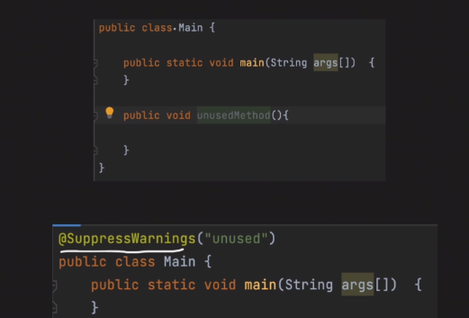

@Functional Interface
- Restrict Onterface to have only 1 abstract method
- Throwa Compilation error,if more than 1 abstract method found
- Can be used over:**Type**(Class or interface or enum)

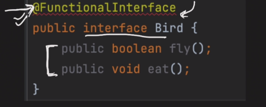

@SafeVarargs:
- Used to suppress "Heap pollution warning"
- Used over methods anf Constructor which has Variable Arguments as Parameter.
- Method should be either static or final(i.e methods which can not be overridden)
- In **Java9**,we can also use it on private methods too.

#### What is Heap Pollution?

Object of One Type(Example String),storing the reference of another type Object(Example Interger)

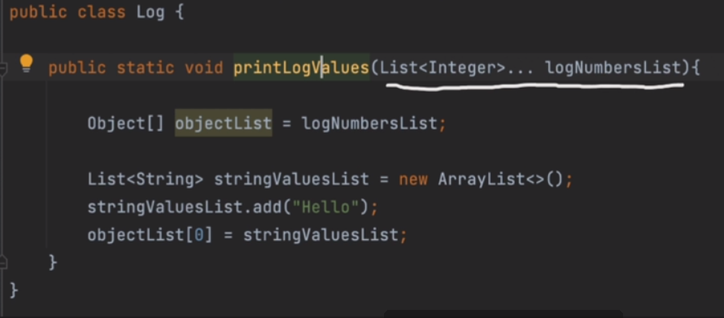
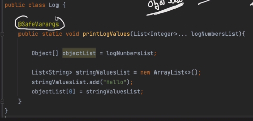

### Annotations used over Another Annotation (Meta-Annitations):

*@Target:*
- This meta-annotation will restrict,where to use the annotation.Either at method or Constuctor or Fields etc...

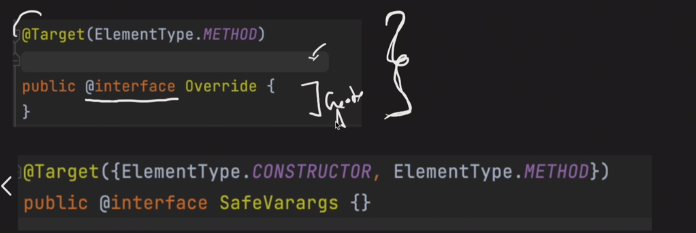

Element Type:
- TYPE
- FIELD
- METHOD
- PARAMETER
- CONSTRUCTOR
- LOCAL VARIABLES
- ANNOTATION_TYPE
- PACKAGE
- TYPE_PARAMETER(allow you to apply on generic type)
- TYPE_USE(java 8 feature,allow you to use annotation at all places where type you can declare(like List<@annotation String>))

@Retention 
- This meta-annotation tells,how Annotation will be stored in java.
  - **RetentionPolicy.**SOURCE:** Annotation will be discarded by the compiler itself and will not be recoreded in .class file
  - RetentionPolicy.**CLASS:** Annotations will be recorded in .class file but will be ignore by JVM at run time
  - RetentionPolicy.**RUNTIME**:Annotation will be recorded in .class file = + availabe during run time.Usage of reflection can be done.

Example1:

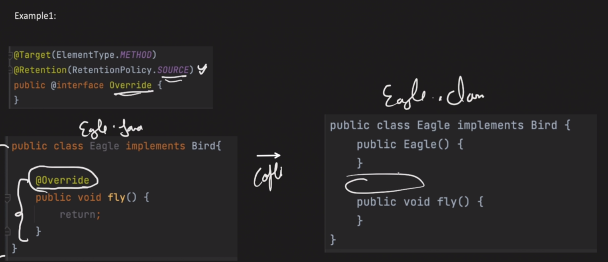

Example2:

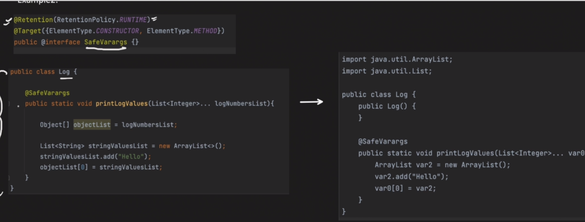

Example3:

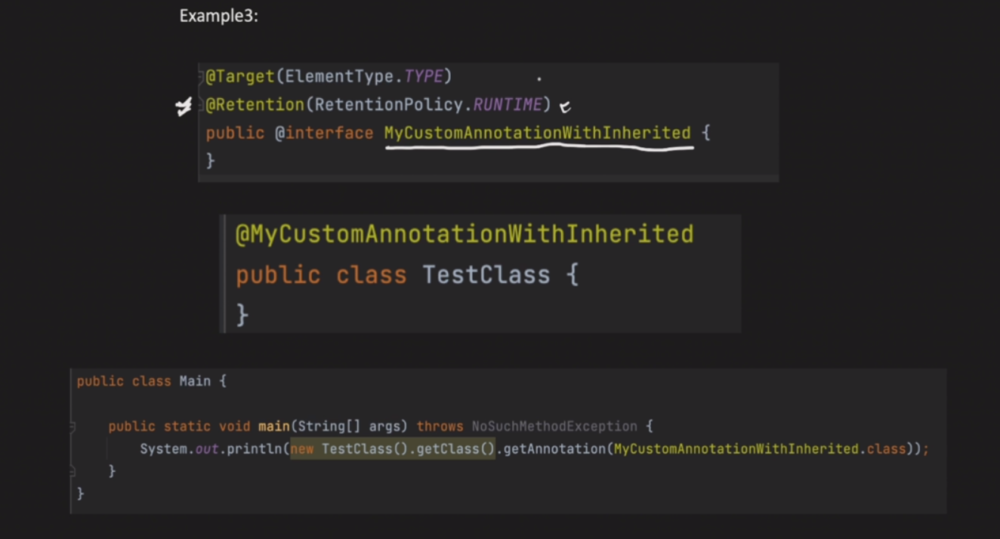

Example4:

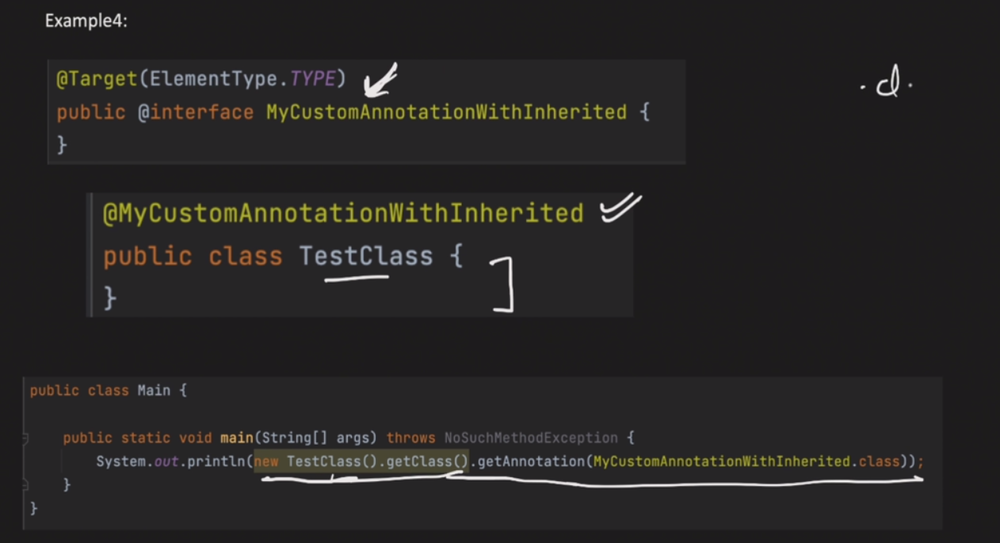

@Documented:
- By default,Annotations are ignored when Java Documentation is generated.
- With this meta =-annotation even Annotations will come in Java Docs.

            Not Documentated:

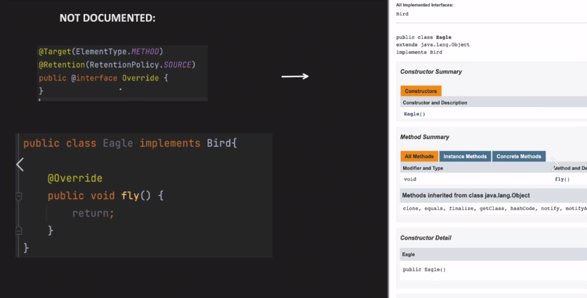

@inherited:
- By default,Annotations applied on parent class are not availbe to child classes.
- But it is after this meta-annotation.
- This Meta-annotation has no effect,if annotation is used other than a class.

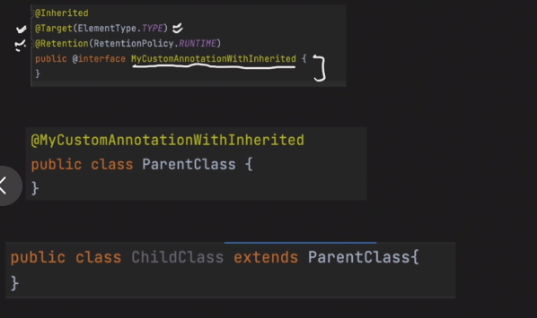
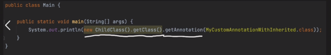

@Repeatable:
- Allows us to use the same annotation more than 1 at dame place.

**We can not do this before JAVA8**

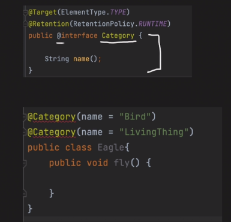
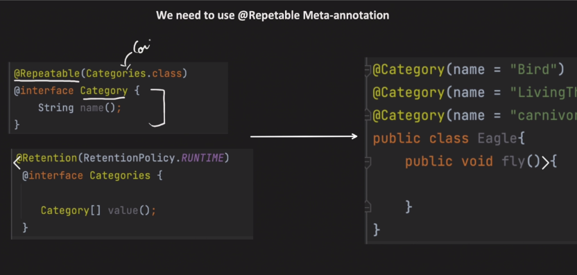
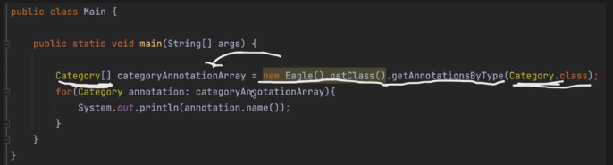

Creating an Annotation with method (its more like a field):
- No paraeter,no body
- Return type is restriced to primitive,Class,Strings,enums,annotations and array of these types.

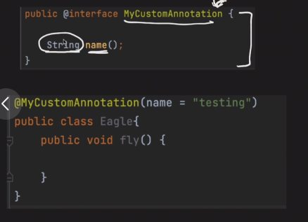