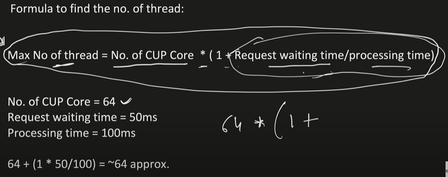
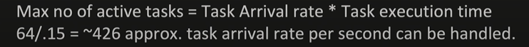
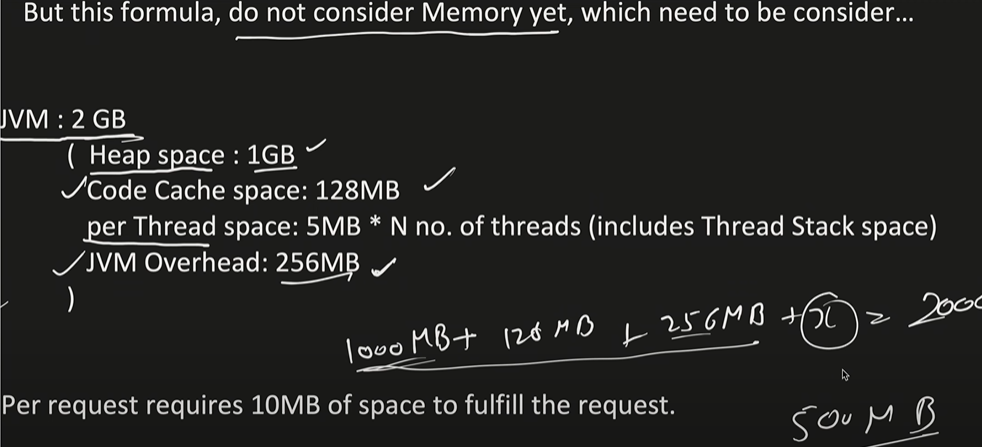
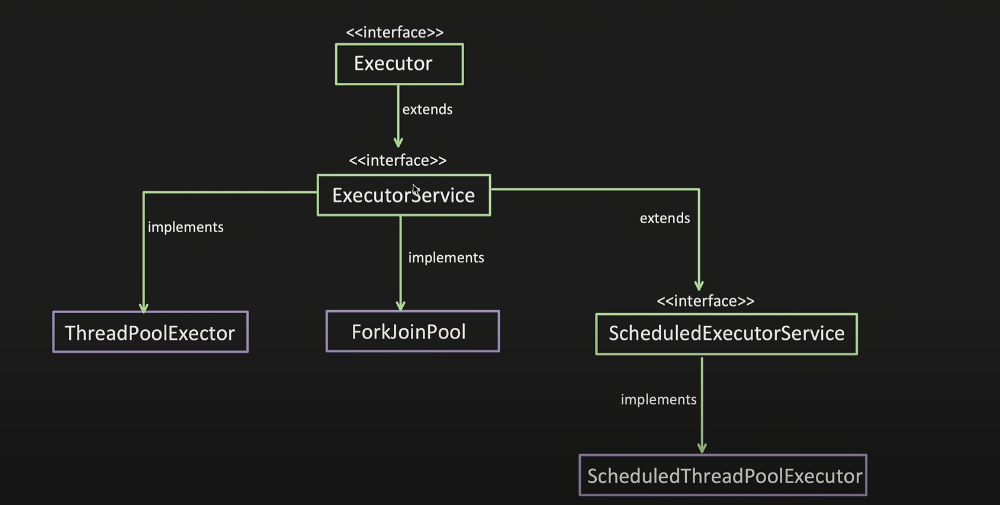
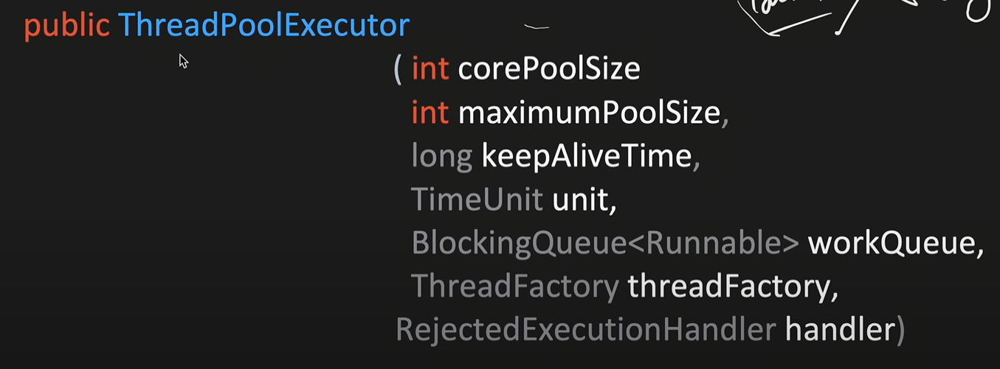
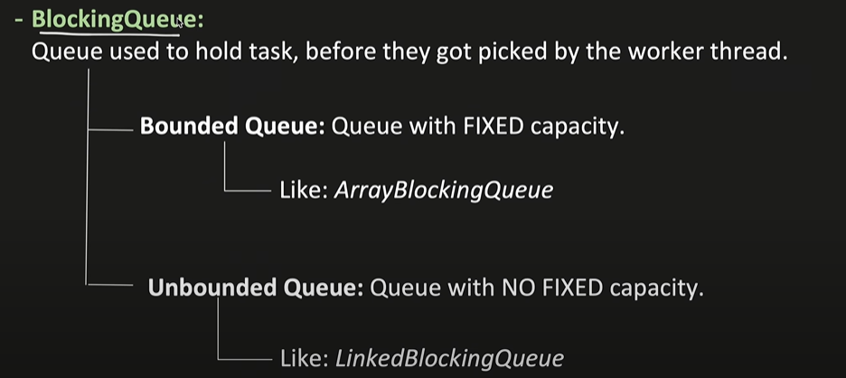
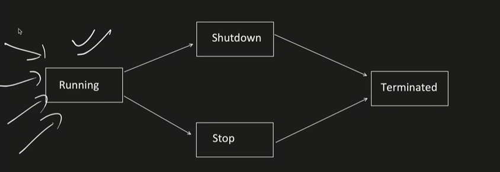

# Stream

## What is Stream?
 - We can consider Stream as a pipeline,through which our collection elements passes through.
 - While elements passes through piprlines,it perfornm various operations likd sorting,filtering etc ...
 - Using eh==when deals with bulk processing (can do parallel processing)

- Sequence of elements − A stream provides a set of elements of specific type in a sequential manner. A stream gets/computes elements on demand. It never stores the elements.

- Source − Stream takes Collections, Arrays, or I/O resources as input source.

- Aggregate operations − Stream supports aggregate operations like filter, map, limit, reduce, find, match, and so on.

- Pipelining − Most of the stream operations return stream itself so that their result can be pipelined. These operations are called intermediate operations and their function is to take input, process them, and return output to the target. collect() method is a terminal operation which is normally present at the end of the pipelining operation to mark the end of the stream.

- Automatic iterations − Stream operations do the iterations internally over the source elements provided, in contrast to Collections where explicit iteration is required.

### Generating Streams in Java
With Java 8, Collection interface has two methods to generate a Stream.

stream() − Returns a sequential stream considering collection as its source.

parallelStream() − Returns a parallel Stream considering collection as its source.

    List<String> strings = Arrays.asList("abc", "", "bc", "efg", "abcd","", "jkl");
    List<String> filtered = strings.stream().filter(string -> !string.isEmpty()).collect(Collectors.toList());

forEach Method

Stream has provided a new method 'forEach' to iterate each element of the stream. The following code segment shows how to print 10 random numbers using forEach.

    Random random = new Random();
    random.ints().limit(10).forEach(System.out::println);

map Method

The 'map' method is used to map each element to its corresponding result. The following code segment prints unique squares of numbers using map.

    List<Integer> numbers = Arrays.asList(3, 2, 2, 3, 7, 3, 5);

    //get list of unique squares
    List<Integer> squaresList = numbers.stream().map( i -> i*i).distinct().collect(Collectors.toList());

filter Method

The 'filter' method is used to eliminate elements based on a criteria. The following code segment prints a count of empty strings using filter.

            List<String>strings = Arrays.asList("abc", "", "bc", "efg", "abcd","", "jkl");

            //get count of empty string
            int count = strings.stream().filter(string -> string.isEmpty()).count();

limit Method

The 'limit' method is used to reduce the size of the stream. The following code segment shows how to print 10 random numbers using limit.

    Random random = new Random();
    random.ints().limit(10).forEach(System.out::println);

sorted Method

The 'sorted' method is used to sort the stream. The following code segment shows how to print 10 random numbers in a sorted order.

    Random random = new Random();
    random.ints().limit(10).sorted().forEach(System.out::println);

Parallel Processing

parallelStream is the alternative of stream for parallel processing. Take a look at the following code segment that prints a count of empty strings using parallelStream.

    List<String> strings = Arrays.asList("abc", "", "bc", "efg", "abcd","", "jkl");
    
    //get count of empty string
    long count = strings.parallelStream().filter(string -> string.isEmpty()).count();
It is very easy to switch between sequential and parallel streams.

Collectors

Collectors are used to combine the result of processing on the elements of a stream. Collectors can be used to return a list or a string.
        
        List<String>strings = Arrays.asList("abc", "", "bc", "efg", "abcd","", "jkl");
        List<String> filtered = strings.stream().filter(string -> !string.isEmpty()).collect(Collectors.toList());
        
        System.out.println("Filtered List: " + filtered);
        String mergedString = strings.stream().filter(string -> !string.isEmpty()).collect(Collectors.joining(", "));
        System.out.println("Merged String: " + mergedString);

Statistics
With Java 8, statistics collectors are introduced to calculate all statistics when stream processing is being done.

    List numbers = Arrays.asList(3, 2, 2, 3, 7, 3, 5);
    
    IntSummaryStatistics stats = numbers.stream().mapToInt((x) -> x).summaryStatistics();
    
    System.out.println("Highest number in List : " + stats.getMax());
    System.out.println("Lowest number in List : " + stats.getMin());
    System.out.println("Sum of all numbers : " + stats.getSum());
    System.out.println("Average of all numbers : " + stats.getAverage());

---

---

---
### Parallel Stream:
Helps to perform operation on stream concurrentky,taking advantage of multi core CPU.

ParallelStream()method is used instead of regular stream()method.

Internally it does:
- Task splitting:it uses "spliterator" Function to split the data into multiple chunks.
- Task submission and parallel processing :Uses Fork-join pool technique.

## Java Thread Pool,ExecutorFramework ExecutorService-Part1

Interview Question:

In ThreadPool,Why you have taken corePoolSize as 2,why not 10 or 15 or another number,what's the logic

Generally,the ThreadPool min and max size are depend on various factors like 
-  CPU Cores
- Jvm Memory 
- Task Nature (Cpu Intensive or I/O Intensive)
- Concurrency Requirement (Want high or medium or low concurrency)
- Memory Required to process a requst 
- Throughput etc.

An its an iterative process to update the min and max values based on monitoring.

## What is ThreadPool:
- It's a collecction of threads (aka Workers),which are available to perfrom the submitted tasks.
- Once task completed,workr thread get back to Thread Pool and wait for new task to assigned .
- Means threads can be reused.

## What's the Advantage of Thread Pool?

#### Thread Creation time can be saved:
- When each thread created,space is allocatedd to it(stack,heap,program counter etc..) and this takes time.
- With thread,this can be avoided by reusing the thread.
#### Overhead of managing the Thread lifecycle can be removed:
- Thread has different state like Running,Waiting,terminate etc.And managing thread state includes complexity.
- Thread pool abstract away this management.

#### Increased the perfformance :
- More threads means ,more Context Switching time,using control over thread creation,excess context switching can be avoided.

#### In package java.util.concurrent we have available a framework :

ThreadPoolExector:
- It's helps to create a customizable ThreadPool.

- corePoolSize:
  - Number of threads are initially created and keep in the pool,even if they are idle.

- allowCoreThreadTimeOut:
  - If this property is set to TRUE(by default its FLASE),idle thread kept Alive till time specified by 'KeepAliveTime'

- KeepAliveTime:
  - Thread,which are idle get terminated after this time.

- maxPoolSize:
  - Maximum nubmber of thread allowed in a pool.
- If no. of thread are == corePoolSize and queue is also full,then new threads are created (till its less than'maxPoolSize').

Excess thread,will remain in pool,this pool is not shutdown or if allowcoreThreadTimeOut is set to true,then excss thread get terminated after remain idle for KeepAliveTime.
 
- TimeUnit:
  -TimeUnit for the keepAliveTime,whether Millisecond or Second or Hours etc.

- BlockingQueue:

- ThreadFactory:
  - Factory for creating new thread.ThreadPoolExecutor use this to create new thread,this Factory provide us an interface to:
    - To give custom Thread name
    - To give custom Thread priority 
    - To set Thread Daemon flag etc.

### Running:
--- 
Executor is in running state and submit()method will be used to add new task.

### ShutDown :
---
  - Executor do not accept new tasks,but continue to process existing tasks,once existing tasks finished,executor moves to terminate state.
  - Method used shutdown()

### Stop(Forcce shutdown):
--- 
- Executor do not accept new tasks.
- Executor forcefully stops all the tasks which are currently execting.
- And once fully shutdown,moves to terminate state
- Method used shutdownNow()

